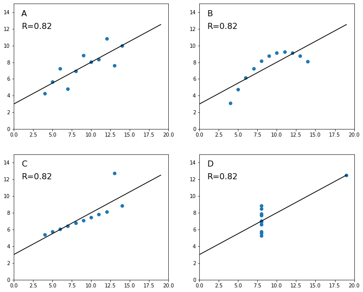

# Anscombe's Quartet

In 1973, the English statistician Francis John Anscombe published a short paper describing the importance of graphs while conducting statistical analysis. According to Anscombre, plotting data can provide unique insights and can help identifying broad features of the dataset and detecting whether the assumptions of the statistical method are met or violated.

Anscombe created a fictitious dataset of four x-y variable pair that share the same statistics:

- Number of observations: 11

- Mean of the x variable: 9.0

- Mean of the y variable: 7.5

- Equation of linear regression model: $y=3+0.5x$

- Coefficient of determination ($R^2$): 0.667

The question is: despite their similar statistical metrics, are these four datasets similar? Can you draw a set of eleven scatter points and a linear regression that will fit the metrics described above?


```python
# Import modules
import pandas as pd
import matplotlib.pyplot as plt
from scipy import stats

```


```python
# Load dataset
df = pd.read_csv('../datasets/anscombe_quartet.csv')
df.head(11) # The entire dataset

```


<div>
<style scoped>
    .dataframe tbody tr th:only-of-type {
        vertical-align: middle;
    }

    .dataframe tbody tr th {
        vertical-align: top;
    }

    .dataframe thead th {
        text-align: right;
    }
</style>
<table border="1" class="dataframe">
  <thead>
    <tr style="text-align: right;">
      <th></th>
      <th>obs</th>
      <th>x1</th>
      <th>y1</th>
      <th>x2</th>
      <th>y2</th>
      <th>x3</th>
      <th>y3</th>
      <th>x4</th>
      <th>y4</th>
    </tr>
  </thead>
  <tbody>
    <tr>
      <th>0</th>
      <td>1</td>
      <td>10</td>
      <td>8.04</td>
      <td>10</td>
      <td>9.14</td>
      <td>10</td>
      <td>7.46</td>
      <td>8</td>
      <td>6.58</td>
    </tr>
    <tr>
      <th>1</th>
      <td>2</td>
      <td>8</td>
      <td>6.95</td>
      <td>8</td>
      <td>8.14</td>
      <td>8</td>
      <td>6.77</td>
      <td>8</td>
      <td>5.76</td>
    </tr>
    <tr>
      <th>2</th>
      <td>3</td>
      <td>13</td>
      <td>7.58</td>
      <td>13</td>
      <td>8.74</td>
      <td>13</td>
      <td>12.74</td>
      <td>8</td>
      <td>7.71</td>
    </tr>
    <tr>
      <th>3</th>
      <td>4</td>
      <td>9</td>
      <td>8.81</td>
      <td>9</td>
      <td>8.77</td>
      <td>9</td>
      <td>7.11</td>
      <td>8</td>
      <td>8.84</td>
    </tr>
    <tr>
      <th>4</th>
      <td>5</td>
      <td>11</td>
      <td>8.33</td>
      <td>11</td>
      <td>9.26</td>
      <td>11</td>
      <td>7.81</td>
      <td>8</td>
      <td>8.47</td>
    </tr>
    <tr>
      <th>5</th>
      <td>6</td>
      <td>14</td>
      <td>9.96</td>
      <td>14</td>
      <td>8.10</td>
      <td>14</td>
      <td>8.84</td>
      <td>8</td>
      <td>7.04</td>
    </tr>
    <tr>
      <th>6</th>
      <td>7</td>
      <td>6</td>
      <td>7.24</td>
      <td>6</td>
      <td>6.13</td>
      <td>6</td>
      <td>6.08</td>
      <td>8</td>
      <td>5.25</td>
    </tr>
    <tr>
      <th>7</th>
      <td>8</td>
      <td>4</td>
      <td>4.26</td>
      <td>4</td>
      <td>3.10</td>
      <td>4</td>
      <td>5.39</td>
      <td>19</td>
      <td>12.50</td>
    </tr>
    <tr>
      <th>8</th>
      <td>9</td>
      <td>12</td>
      <td>10.84</td>
      <td>12</td>
      <td>9.13</td>
      <td>12</td>
      <td>8.15</td>
      <td>8</td>
      <td>5.56</td>
    </tr>
    <tr>
      <th>9</th>
      <td>10</td>
      <td>7</td>
      <td>4.82</td>
      <td>7</td>
      <td>7.26</td>
      <td>7</td>
      <td>6.42</td>
      <td>8</td>
      <td>7.91</td>
    </tr>
    <tr>
      <th>10</th>
      <td>11</td>
      <td>5</td>
      <td>5.68</td>
      <td>5</td>
      <td>4.74</td>
      <td>5</td>
      <td>5.73</td>
      <td>8</td>
      <td>6.89</td>
    </tr>
  </tbody>
</table>
</div>


```python
# Define a linear model
lm = lambda x,intercept,slope: intercept + slope*x

```


```python
# Let's set the components of the subplots so that
# we closely replicate the figures generated by Anscombe
# in his original manuscript publsihed in 1973.

xlims = (0,20)               # limits of x axis
ylims = (0,15)               # limits of y axis
letter_txt_coords = (1,13.5) # coordinates for plot label (A,B,C, or D)
r_txt_coords = (1,12)        # coordinates for the coefficient of correlation
x_range = range(0,20)        # Range of x values to generate y values with the model
font_size = 16               # Fontsize for all subplots


# Figure
plt.figure(figsize=(12,10))

# Subplot in square 1
plt.subplot(2,2,1)
plt.scatter(df.x1, df.y1)
slope, intercept, r_val, p_val, std_err = stats.linregress(df.x1, df.y1)
y_pred = lm(x_range,intercept,slope)
plt.plot(x_range, y_pred, 'k')
plt.annotate('A', letter_txt_coords, size=font_size)
plt.annotate('R=' + str(round(r_val,2)), r_txt_coords, size=font_size)
plt.xlim(xlims)
plt.ylim(ylims)

# Subplot in square 2
plt.subplot(2,2,2)
plt.scatter(df.x2, df.y2)
slope, intercept, r_val, p_val, std_err = stats.linregress(df.x2, df.y2)
y_pred = lm(x_range,intercept,slope)
plt.plot(x_range, y_pred, 'k')
plt.annotate('B', letter_txt_coords, size=font_size)
plt.annotate('R=' + str(round(r_val,2)), r_txt_coords, size=font_size)
plt.xlim(xlims)
plt.ylim(ylims)

# Subplot in square 3
plt.subplot(2,2,3)
plt.scatter(df.x3, df.y3)
slope, intercept, r_val, p_val, std_err = stats.linregress(df.x3, df.y3)
y_pred = lm(x_range,intercept,slope)
plt.plot(x_range, y_pred, 'k')
plt.annotate('C', letter_txt_coords, size=font_size)
plt.annotate('R=' + str(round(r_val,2)), r_txt_coords, size=font_size)
plt.xlim(xlims)
plt.ylim(ylims)

# Subplot in square 4
plt.subplot(2,2,4)
plt.scatter(df.x4, df.y4)
slope, intercept, r_val, p_val, std_err = stats.linregress(df.x4, df.y4)
y_pred = lm(x_range,intercept,slope)
plt.plot(x_range, y_pred, 'k')
plt.annotate('D', letter_txt_coords, size=font_size)
plt.annotate('R=' + str(round(r_val,2)), r_txt_coords, size=font_size)
plt.xlim(xlims)
plt.ylim(ylims)

plt.show()

```





## Comments

- Were you expecting the coefficient of correlation to be identical across all four sets? 

- What do you think about plot A versus plot D?

- Is a linear model the correct model for figure B?


## References

Anscombe, F.J., 1973. Graphs in statistical analysis. The American Statistician, 27(1), pp.17-21.
