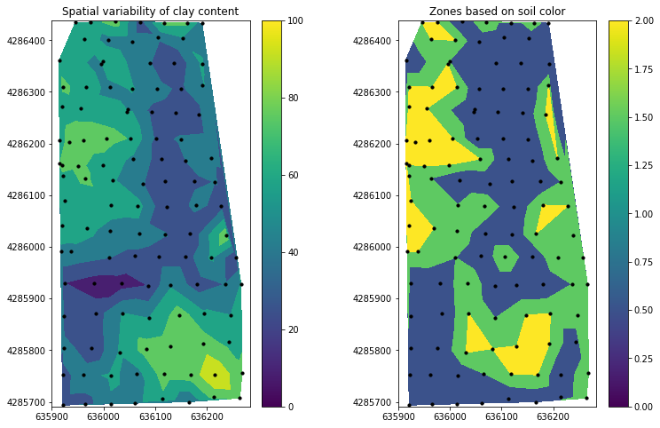

# Field Management Zones

In this exercise we will classify field management zones base on soil color and soil texture. Soil color is represented by the `Lab` color system and soil texture was determined by the Hydrometer method. The soil textural class was determined using the USDA-NRCS soil classification triangle.

The dataset contains four different soil textural classes.


```python
# Import modules
import numpy as np
import pandas as pd
import matplotlib.pyplot as plt

from sklearn.cluster import KMeans

```


```python
# Load data
data = pd.read_csv('../datasets/field_spatial_variability.csv')
data.head()

```


<div>
<style scoped>
    .dataframe tbody tr th:only-of-type {
        vertical-align: middle;
    }

    .dataframe tbody tr th {
        vertical-align: top;
    }

    .dataframe thead th {
        text-align: right;
    }
</style>
<table border="1" class="dataframe">
  <thead>
    <tr style="text-align: right;">
      <th></th>
      <th>latitude</th>
      <th>longitude</th>
      <th>X</th>
      <th>Y</th>
      <th>sand</th>
      <th>clay</th>
      <th>L</th>
      <th>a</th>
      <th>b</th>
      <th>textural_class</th>
    </tr>
  </thead>
  <tbody>
    <tr>
      <th>0</th>
      <td>38.71337</td>
      <td>-97.43272</td>
      <td>636266.5785</td>
      <td>4285928.184</td>
      <td>29.5</td>
      <td>25.2</td>
      <td>40.4</td>
      <td>5.1</td>
      <td>10.6</td>
      <td>Loam</td>
    </tr>
    <tr>
      <th>1</th>
      <td>38.71386</td>
      <td>-97.43394</td>
      <td>636159.5704</td>
      <td>4285980.746</td>
      <td>44.4</td>
      <td>17.5</td>
      <td>46.0</td>
      <td>7.9</td>
      <td>15.6</td>
      <td>Loam</td>
    </tr>
    <tr>
      <th>2</th>
      <td>38.71342</td>
      <td>-97.43600</td>
      <td>635981.2897</td>
      <td>4285928.857</td>
      <td>47.5</td>
      <td>12.5</td>
      <td>46.3</td>
      <td>7.7</td>
      <td>15.3</td>
      <td>Loam</td>
    </tr>
    <tr>
      <th>3</th>
      <td>38.71383</td>
      <td>-97.43282</td>
      <td>636257.0101</td>
      <td>4285979.083</td>
      <td>47.1</td>
      <td>15.1</td>
      <td>42.7</td>
      <td>7.0</td>
      <td>13.3</td>
      <td>Loam</td>
    </tr>
    <tr>
      <th>4</th>
      <td>38.71338</td>
      <td>-97.43371</td>
      <td>636180.4796</td>
      <td>4285927.821</td>
      <td>41.3</td>
      <td>17.5</td>
      <td>46.8</td>
      <td>7.2</td>
      <td>14.6</td>
      <td>Loam</td>
    </tr>
  </tbody>
</table>
</div>


```python
# Bottom rows
data.tail()

```


<div>
<style scoped>
    .dataframe tbody tr th:only-of-type {
        vertical-align: middle;
    }

    .dataframe tbody tr th {
        vertical-align: top;
    }

    .dataframe thead th {
        text-align: right;
    }
</style>
<table border="1" class="dataframe">
  <thead>
    <tr style="text-align: right;">
      <th></th>
      <th>latitude</th>
      <th>longitude</th>
      <th>X</th>
      <th>Y</th>
      <th>sand</th>
      <th>clay</th>
      <th>L</th>
      <th>a</th>
      <th>b</th>
      <th>textural_class</th>
    </tr>
  </thead>
  <tbody>
    <tr>
      <th>108</th>
      <td>38.71640</td>
      <td>-97.43465</td>
      <td>636093.0191</td>
      <td>4286261.561</td>
      <td>45.1</td>
      <td>19.0</td>
      <td>46.6</td>
      <td>7.2</td>
      <td>14.8</td>
      <td>Loam</td>
    </tr>
    <tr>
      <th>109</th>
      <td>38.71651</td>
      <td>-97.43664</td>
      <td>635919.7888</td>
      <td>4286270.812</td>
      <td>26.2</td>
      <td>26.8</td>
      <td>42.5</td>
      <td>5.8</td>
      <td>11.5</td>
      <td>Loam</td>
    </tr>
    <tr>
      <th>110</th>
      <td>38.71685</td>
      <td>-97.43610</td>
      <td>635966.0951</td>
      <td>4286309.345</td>
      <td>23.0</td>
      <td>28.1</td>
      <td>42.9</td>
      <td>5.7</td>
      <td>11.5</td>
      <td>Clay loam</td>
    </tr>
    <tr>
      <th>111</th>
      <td>38.71725</td>
      <td>-97.43575</td>
      <td>635995.7677</td>
      <td>4286354.253</td>
      <td>29.4</td>
      <td>23.0</td>
      <td>44.4</td>
      <td>5.9</td>
      <td>11.9</td>
      <td>Loam</td>
    </tr>
    <tr>
      <th>112</th>
      <td>38.71766</td>
      <td>-97.43558</td>
      <td>636009.7710</td>
      <td>4286400.005</td>
      <td>31.9</td>
      <td>23.0</td>
      <td>45.0</td>
      <td>6.2</td>
      <td>12.8</td>
      <td>Loam</td>
    </tr>
  </tbody>
</table>
</div>


```python
# Select variables
X = data[['L','a','b']]
X.head()

```


<div>
<style scoped>
    .dataframe tbody tr th:only-of-type {
        vertical-align: middle;
    }

    .dataframe tbody tr th {
        vertical-align: top;
    }

    .dataframe thead th {
        text-align: right;
    }
</style>
<table border="1" class="dataframe">
  <thead>
    <tr style="text-align: right;">
      <th></th>
      <th>L</th>
      <th>a</th>
      <th>b</th>
    </tr>
  </thead>
  <tbody>
    <tr>
      <th>0</th>
      <td>40.4</td>
      <td>5.1</td>
      <td>10.6</td>
    </tr>
    <tr>
      <th>1</th>
      <td>46.0</td>
      <td>7.9</td>
      <td>15.6</td>
    </tr>
    <tr>
      <th>2</th>
      <td>46.3</td>
      <td>7.7</td>
      <td>15.3</td>
    </tr>
    <tr>
      <th>3</th>
      <td>42.7</td>
      <td>7.0</td>
      <td>13.3</td>
    </tr>
    <tr>
      <th>4</th>
      <td>46.8</td>
      <td>7.2</td>
      <td>14.6</td>
    </tr>
  </tbody>
</table>
</div>


```python
# Clustering
k_zones = 3 # An arbitrary but reasonable number of field management zones.
y_pred = KMeans(n_clusters=k_zones, random_state=0).fit_predict(X)
print(y_pred)

```

    [1 0 0 2 0 0 0 1 2 2 0 2 2 2 1 1 1 1 0 0 0 2 2 2 0 0 1 0 2 0 2 1 2 0 2 1 0
     0 0 2 2 2 2 2 0 2 2 0 2 2 1 0 2 0 0 0 0 2 0 2 0 0 0 0 0 2 0 2 0 2 0 0 2 0
     0 0 2 2 2 2 2 2 0 0 0 2 0 1 2 2 0 2 0 2 2 2 0 0 2 0 2 0 0 2 2 0 0 0 0 2 2
     2 2]


```python
# Append classification to original dataframe
data['clusters'] = y_pred
data

```


<div>
<style scoped>
    .dataframe tbody tr th:only-of-type {
        vertical-align: middle;
    }

    .dataframe tbody tr th {
        vertical-align: top;
    }

    .dataframe thead th {
        text-align: right;
    }
</style>
<table border="1" class="dataframe">
  <thead>
    <tr style="text-align: right;">
      <th></th>
      <th>latitude</th>
      <th>longitude</th>
      <th>X</th>
      <th>Y</th>
      <th>sand</th>
      <th>clay</th>
      <th>L</th>
      <th>a</th>
      <th>b</th>
      <th>textural_class</th>
      <th>clusters</th>
    </tr>
  </thead>
  <tbody>
    <tr>
      <th>0</th>
      <td>38.71337</td>
      <td>-97.43272</td>
      <td>636266.5785</td>
      <td>4285928.184</td>
      <td>29.5</td>
      <td>25.2</td>
      <td>40.4</td>
      <td>5.1</td>
      <td>10.6</td>
      <td>Loam</td>
      <td>1</td>
    </tr>
    <tr>
      <th>1</th>
      <td>38.71386</td>
      <td>-97.43394</td>
      <td>636159.5704</td>
      <td>4285980.746</td>
      <td>44.4</td>
      <td>17.5</td>
      <td>46.0</td>
      <td>7.9</td>
      <td>15.6</td>
      <td>Loam</td>
      <td>0</td>
    </tr>
    <tr>
      <th>2</th>
      <td>38.71342</td>
      <td>-97.43600</td>
      <td>635981.2897</td>
      <td>4285928.857</td>
      <td>47.5</td>
      <td>12.5</td>
      <td>46.3</td>
      <td>7.7</td>
      <td>15.3</td>
      <td>Loam</td>
      <td>0</td>
    </tr>
    <tr>
      <th>3</th>
      <td>38.71383</td>
      <td>-97.43282</td>
      <td>636257.0101</td>
      <td>4285979.083</td>
      <td>47.1</td>
      <td>15.1</td>
      <td>42.7</td>
      <td>7.0</td>
      <td>13.3</td>
      <td>Loam</td>
      <td>2</td>
    </tr>
    <tr>
      <th>4</th>
      <td>38.71338</td>
      <td>-97.43371</td>
      <td>636180.4796</td>
      <td>4285927.821</td>
      <td>41.3</td>
      <td>17.5</td>
      <td>46.8</td>
      <td>7.2</td>
      <td>14.6</td>
      <td>Loam</td>
      <td>0</td>
    </tr>
    <tr>
      <th>...</th>
      <td>...</td>
      <td>...</td>
      <td>...</td>
      <td>...</td>
      <td>...</td>
      <td>...</td>
      <td>...</td>
      <td>...</td>
      <td>...</td>
      <td>...</td>
      <td>...</td>
    </tr>
    <tr>
      <th>108</th>
      <td>38.71640</td>
      <td>-97.43465</td>
      <td>636093.0191</td>
      <td>4286261.561</td>
      <td>45.1</td>
      <td>19.0</td>
      <td>46.6</td>
      <td>7.2</td>
      <td>14.8</td>
      <td>Loam</td>
      <td>0</td>
    </tr>
    <tr>
      <th>109</th>
      <td>38.71651</td>
      <td>-97.43664</td>
      <td>635919.7888</td>
      <td>4286270.812</td>
      <td>26.2</td>
      <td>26.8</td>
      <td>42.5</td>
      <td>5.8</td>
      <td>11.5</td>
      <td>Loam</td>
      <td>2</td>
    </tr>
    <tr>
      <th>110</th>
      <td>38.71685</td>
      <td>-97.43610</td>
      <td>635966.0951</td>
      <td>4286309.345</td>
      <td>23.0</td>
      <td>28.1</td>
      <td>42.9</td>
      <td>5.7</td>
      <td>11.5</td>
      <td>Clay loam</td>
      <td>2</td>
    </tr>
    <tr>
      <th>111</th>
      <td>38.71725</td>
      <td>-97.43575</td>
      <td>635995.7677</td>
      <td>4286354.253</td>
      <td>29.4</td>
      <td>23.0</td>
      <td>44.4</td>
      <td>5.9</td>
      <td>11.9</td>
      <td>Loam</td>
      <td>2</td>
    </tr>
    <tr>
      <th>112</th>
      <td>38.71766</td>
      <td>-97.43558</td>
      <td>636009.7710</td>
      <td>4286400.005</td>
      <td>31.9</td>
      <td>23.0</td>
      <td>45.0</td>
      <td>6.2</td>
      <td>12.8</td>
      <td>Loam</td>
      <td>2</td>
    </tr>
  </tbody>
</table>
<p>113 rows × 11 columns</p>
</div>


```python
# Show correlations between variables. Let's add some soil texture
# to see how sand and clay are related to the clusters.
plt.figure(figsize=(8, 8))
plt.subplot(221)
plt.scatter(data['sand'], data['clay'], c=y_pred)
plt.xlabel('Sand (%)')
plt.ylabel('Clay (%)')

plt.subplot(222)
plt.scatter(data['L'], data['a'], c=y_pred)
plt.xlabel('L')
plt.ylabel('a')

plt.subplot(223)
plt.scatter(data['L'], data['b'], c=y_pred)
plt.xlabel('L')
plt.ylabel('b')

plt.subplot(224)
plt.scatter(data['a'], data['b'], c=y_pred)
plt.xlabel('a')
plt.ylabel('b')

plt.show()
```


```python
# Plot field managment zones
plt.figure(figsize=(12,8))
plt.subplot(121)
plt.title('Spatial variability of clay content')
plt.tricontourf(data['X'], data['Y'], data['clay'], levels=5)
plt.scatter(data['X'], data['Y'], s=10, marker='o', facecolors='k')
plt.axis('equal')
plt.clim(0, 100)
plt.colorbar()

plt.subplot(122)
plt.title('Zones based on soil color')
plt.tricontourf(data['X'], data['Y'], data['clusters'], 
                cmap="viridis", 
                levels=[0,1,2], 
                extend='both')
plt.scatter(data['X'], data['Y'], s=10, marker='o', facecolors='k')
plt.axis('equal')
plt.clim(0, 2)
plt.colorbar()

plt.subplots_adjust(wspace=0.4)
#plt.colorbar()
plt.show()

# Matplotlib cmaps: https://matplotlib.org/tutorials/colors/colormaps.html
```





## Observations

- Does the soil color classification match the spatial patterns of soil textural class?

- How can we compare the similarity between the resulting classified map and another map of a given soil physical property?

- What is the right number of clusters in which we need to divide a dataset?

## References

Arthur, D. and Vassilvitskii, S., 2007, January. k-means++: The advantages of careful seeding. In Proceedings of the eighteenth annual ACM-SIAM symposium on Discrete algorithms (pp. 1027-1035). Society for Industrial and Applied Mathematics.

Hartigan, J.A. and Wong, M.A., 1979. Algorithm AS 136: A k-means clustering algorithm. Journal of the Royal Statistical Society. Series C (Applied Statistics), 28(1), pp.100-108.

Konen, M.E., Burras, C.L. and Sandor, J.A., 2003. Organic carbon, texture, and quantitative color measurement relationships for cultivated soils in north central Iowa. Soil Science Society of America Journal, 67(6), pp.1823-1830.

