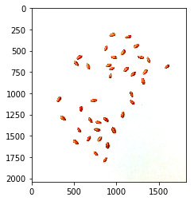
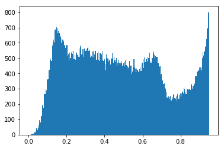
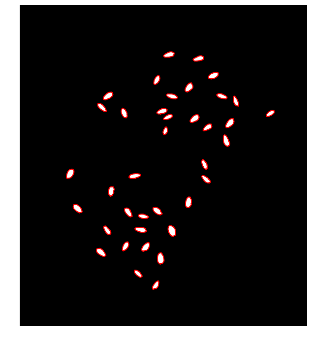
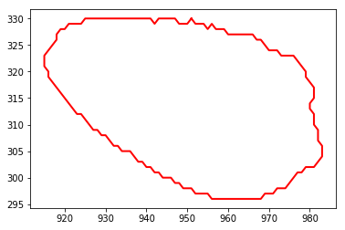
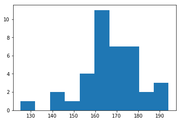
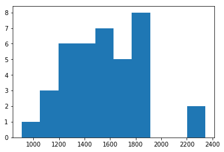

# Counting seeds

Example on how to use image analysis to identify and count seeds. In this tutorial we use the scikit-image library.


```python
import glob
import numpy as np
import matplotlib.pyplot as plt
import matplotlib.image as mpimg

from skimage.color import rgb2gray, label2rgb
from skimage.morphology import erosion, disk
from skimage.measure import find_contours, label, regionprops
```


```python
glob.os.chdir('/Users/andrespatrignani//Dropbox/Teaching/Scientific programming/introcoding-spring-2019/Datasets/')

```


```python
RGB = mpimg.imread('seeds.jpg')
```


```python
plt.imshow(RGB)
plt.show()
```





```python
plt.plot(RGB[600,:,0], '-r', label='Red band')
plt.plot(RGB[600,:,1], '-g', label='Green band')
plt.plot(RGB[600,:,2], '-b', label='Blue band')
plt.legend()
plt.show()
```


```python
grayscale = rgb2gray(RGB)
```


```python
plt.imshow(grayscale, cmap='gray')
plt.axis('off')
plt.show()
```


```python
print(grayscale.shape)
```

    (2040, 1826)


```python
plt.plot(grayscale[601,:], '-k', label='Grayscale band')
plt.legend()
plt.show()
```


```python
plt.hist(grayscale.flatten(), bins=256, range=(0.0, 0.95))
plt.show()
```





```python
plt.figure(figsize=(8,8))
idx_seeds = grayscale < 0.9
plt.imshow(idx_seeds, cmap='gray')
plt.axis('off')
plt.show()
```


```python
selem = disk(6)
eroded = erosion(idx_seeds, selem)
```


```python
plt.figure(figsize=(8,8))
plt.axis('off')
plt.imshow(eroded, cmap='gray')
plt.show()
```


```python
contours = find_contours(eroded, 0)
```


```python
plt.figure(figsize=(12,12))
plt.imshow(eroded, cmap='gray')
plt.axis('off')
for contour in contours:
    plt.plot(contour[:, 1], contour[:, 0], '-r', linewidth=2)

```





```python
# Number of seeds
len(contours)
```


    38


```python
# Single seed
plt.plot(contours[0][:, 1], contours[0][:, 0], '-r', linewidth=2)
plt.show()
```





```python
# label image regions
label_image = label(eroded)
image_label_overlay = label2rgb(label_image, image=RGB)

```


```python
fig, ax = plt.subplots(figsize=(10, 6))
ax.imshow(image_label_overlay)
plt.axis('off')
plt.show()

```


```python
region = regionprops(label_image)
```


```python
from pprint import pprint
pprint(dir(region[0]))
```

    ['__class__',
     '__delattr__',
     '__dict__',
     '__dir__',
     '__doc__',
     '__eq__',
     '__format__',
     '__ge__',
     '__getattribute__',
     '__getitem__',
     '__gt__',
     '__hash__',
     '__init__',
     '__init_subclass__',
     '__iter__',
     '__le__',
     '__lt__',
     '__module__',
     '__ne__',
     '__new__',
     '__reduce__',
     '__reduce_ex__',
     '__repr__',
     '__setattr__',
     '__sizeof__',
     '__str__',
     '__subclasshook__',
     '__weakref__',
     '_cache',
     '_cache_active',
     '_intensity_image',
     '_intensity_image_double',
     '_label_image',
     '_ndim',
     '_slice',
     '_transpose_moments',
     '_use_xy_warning',
     'area',
     'bbox',
     'bbox_area',
     'centroid',
     'convex_area',
     'convex_image',
     'coords',
     'eccentricity',
     'equivalent_diameter',
     'euler_number',
     'extent',
     'filled_area',
     'filled_image',
     'image',
     'inertia_tensor',
     'inertia_tensor_eigvals',
     'intensity_image',
     'label',
     'local_centroid',
     'major_axis_length',
     'max_intensity',
     'mean_intensity',
     'min_intensity',
     'minor_axis_length',
     'moments',
     'moments_central',
     'moments_hu',
     'moments_normalized',
     'orientation',
     'perimeter',
     'solidity',
     'weighted_centroid',
     'weighted_local_centroid',
     'weighted_moments',
     'weighted_moments_central',
     'weighted_moments_hu',
     'weighted_moments_normalized']


```python
# Eccentricity is the measure of aspect ratio
seed_volume = []
seed_area = []
seed_eccentricity = []
seed_perimeter = []
for item in region:
    major_axis = item.major_axis_length/10 # 10 pixels per millimeter
    minor_axis = item.minor_axis_length/10 # 10 pixels per millimeter
    seed_volume.append(4/3*np.pi*major_axis**2 * minor_axis)
    seed_area.append(item.area)
    seed_eccentricity.append(item.major_axis_length/item.minor_axis_length)
    seed_perimeter.append(item.perimeter)

```


```python
plt.hist(seed_perimeter)
plt.show()
```





```python
plt.hist(seed_eccentricity)
plt.show()
```


```python
plt.hist(seed_area)
plt.show()
```




