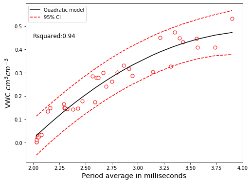

# Linear Regression

Univariate and multivariate linear regression with and without the use of categorical variables (e.g. soil type) and interactions.

In this exercise we will improve the readings of the FeildScout hand-held soil moisture sensor. An experiment was conduted in the KSU Soil Water Processes lab to collect obsevations in containers with packed soil and carefully measured soil moisture. 

The experiment consisted of multiple soil moisture contents for a total of four contrasting soil textures (silt loam, silty clay, clay loam, and sand), with the aim of generating a universal csutom model that converts period average (the raw varaible measured by the sensor) into volumetric water content (volume of water per unit volume of soil).


```python
# Import modules
import pandas as pd
import numpy as np
import matplotlib.pyplot as plt

from statsmodels.formula.api import ols
from statsmodels.sandbox.regression.predstd import wls_prediction_std
from statsmodels.graphics.api import qqplot

```


```python
# Load data
df = pd.read_csv('../datasets/soil_moisture_sensor_calibration_data.csv')
df.head()

```


<div>
<style scoped>
    .dataframe tbody tr th:only-of-type {
        vertical-align: middle;
    }

    .dataframe tbody tr th {
        vertical-align: top;
    }

    .dataframe thead th {
        text-align: right;
    }
</style>
<table border="1" class="dataframe">
  <thead>
    <tr style="text-align: right;">
      <th></th>
      <th>site</th>
      <th>soil_texture</th>
      <th>vwc_sensor</th>
      <th>period</th>
      <th>bulk_density</th>
      <th>vwc_obs</th>
    </tr>
  </thead>
  <tbody>
    <tr>
      <th>0</th>
      <td>Moundridge_bottomslope</td>
      <td>loam</td>
      <td>1.70</td>
      <td>2040</td>
      <td>1.34</td>
      <td>0.023</td>
    </tr>
    <tr>
      <th>1</th>
      <td>Moundridge_bottomslope</td>
      <td>loam</td>
      <td>14.90</td>
      <td>2295</td>
      <td>1.30</td>
      <td>0.149</td>
    </tr>
    <tr>
      <th>2</th>
      <td>Moundridge_bottomslope</td>
      <td>loam</td>
      <td>14.40</td>
      <td>2290</td>
      <td>1.18</td>
      <td>0.165</td>
    </tr>
    <tr>
      <th>3</th>
      <td>Moundridge_bottomslope</td>
      <td>loam</td>
      <td>44.65</td>
      <td>2915</td>
      <td>1.27</td>
      <td>0.316</td>
    </tr>
    <tr>
      <th>4</th>
      <td>Moundridge_bottomslope</td>
      <td>loam</td>
      <td>64.00</td>
      <td>3315</td>
      <td>1.49</td>
      <td>0.328</td>
    </tr>
  </tbody>
</table>
</div>


```python
# Unit conversions
df["vwc_sensor"] = df["vwc_sensor"]/100 # from percent to fraction to match obs
df["period"] = df["period"] /1000 # from microseconds to milliseconds

```


```python
# Sort dataframe by the independent variable period
df.sort_values(by="period", inplace=True)
df.head()

```


<div>
<style scoped>
    .dataframe tbody tr th:only-of-type {
        vertical-align: middle;
    }

    .dataframe tbody tr th {
        vertical-align: top;
    }

    .dataframe thead th {
        text-align: right;
    }
</style>
<table border="1" class="dataframe">
  <thead>
    <tr style="text-align: right;">
      <th></th>
      <th>site</th>
      <th>soil_texture</th>
      <th>vwc_sensor</th>
      <th>period</th>
      <th>bulk_density</th>
      <th>vwc_obs</th>
    </tr>
  </thead>
  <tbody>
    <tr>
      <th>31</th>
      <td>Sand</td>
      <td>sand</td>
      <td>0.0060</td>
      <td>2.03</td>
      <td>1.71</td>
      <td>0.002</td>
    </tr>
    <tr>
      <th>32</th>
      <td>Sand</td>
      <td>sand</td>
      <td>0.0145</td>
      <td>2.03</td>
      <td>1.70</td>
      <td>0.003</td>
    </tr>
    <tr>
      <th>7</th>
      <td>Moundridge_upslope_subsurf</td>
      <td>silty clay</td>
      <td>0.0120</td>
      <td>2.03</td>
      <td>1.29</td>
      <td>0.013</td>
    </tr>
    <tr>
      <th>0</th>
      <td>Moundridge_bottomslope</td>
      <td>loam</td>
      <td>0.0170</td>
      <td>2.04</td>
      <td>1.34</td>
      <td>0.023</td>
    </tr>
    <tr>
      <th>16</th>
      <td>Moundridge_upslope_surf</td>
      <td>silty clay loam</td>
      <td>0.0195</td>
      <td>2.04</td>
      <td>1.35</td>
      <td>0.025</td>
    </tr>
  </tbody>
</table>
</div>


```python
# Plot sensor and observed data
plt.figure(figsize=(8,6))
plt.scatter(df["period"],df['vwc_sensor'], s=50, facecolor='w', edgecolor='k')
plt.scatter(df["period"], df["vwc_obs"], s=50, facecolor='w', edgecolor='r')
plt.xlabel('Period average in milliseconds')
plt.ylabel('VWC observed $cm^3 cm^{-3}$')
plt.legend(['VWC sensor','VWC obs'])
plt.show()

```


The problem is clear, typical volumetric water contents for mineral soils (opposed to organic soils) have a maximum value of 0.5 cm$^3$ cm$^{-3}$, which is approximately the pore space of the soil. The soil moisture sensors in question with its factory calibration returns values of volumetric water content much higher than usual porosity values. This means that the factory calibration to convert period average into volumetric water content is not adequate for the soils tested in this experiment.

Our goal is to find a better model. This will also imply that when we use this sensor we need to ignore the readings in volumetric water content and we need to record the raw period average readings for posterior trasnlation using our custom model.


## Linear model

THe simplest and easiest model to start our linear regression exercise


```python
# Model as a function of period
formula = 'vwc_obs ~ period'
lm = ols(formula, data=df).fit()
lm.summary()

```


<table class="simpletable">
<caption>OLS Regression Results</caption>
<tr>
  <th>Dep. Variable:</th>         <td>vwc_obs</td>     <th>  R-squared:         </th> <td>   0.907</td>
</tr>
<tr>
  <th>Model:</th>                   <td>OLS</td>       <th>  Adj. R-squared:    </th> <td>   0.904</td>
</tr>
<tr>
  <th>Method:</th>             <td>Least Squares</td>  <th>  F-statistic:       </th> <td>   359.2</td>
</tr>
<tr>
  <th>Date:</th>             <td>Wed, 29 Apr 2020</td> <th>  Prob (F-statistic):</th> <td>1.22e-20</td>
</tr>
<tr>
  <th>Time:</th>                 <td>11:05:26</td>     <th>  Log-Likelihood:    </th> <td>  64.186</td>
</tr>
<tr>
  <th>No. Observations:</th>      <td>    39</td>      <th>  AIC:               </th> <td>  -124.4</td>
</tr>
<tr>
  <th>Df Residuals:</th>          <td>    37</td>      <th>  BIC:               </th> <td>  -121.0</td>
</tr>
<tr>
  <th>Df Model:</th>              <td>     1</td>      <th>                     </th>     <td> </td>   
</tr>
<tr>
  <th>Covariance Type:</th>      <td>nonrobust</td>    <th>                     </th>     <td> </td>   
</tr>
</table>
<table class="simpletable">
<tr>
      <td></td>         <th>coef</th>     <th>std err</th>      <th>t</th>      <th>P>|t|</th>  <th>[0.025</th>    <th>0.975]</th>  
</tr>
<tr>
  <th>Intercept</th> <td>   -0.4786</td> <td>    0.038</td> <td>  -12.597</td> <td> 0.000</td> <td>   -0.556</td> <td>   -0.402</td>
</tr>
<tr>
  <th>period</th>    <td>    0.2649</td> <td>    0.014</td> <td>   18.953</td> <td> 0.000</td> <td>    0.237</td> <td>    0.293</td>
</tr>
</table>
<table class="simpletable">
<tr>
  <th>Omnibus:</th>       <td> 2.321</td> <th>  Durbin-Watson:     </th> <td>   1.397</td>
</tr>
<tr>
  <th>Prob(Omnibus):</th> <td> 0.313</td> <th>  Jarque-Bera (JB):  </th> <td>   1.311</td>
</tr>
<tr>
  <th>Skew:</th>          <td> 0.064</td> <th>  Prob(JB):          </th> <td>   0.519</td>
</tr>
<tr>
  <th>Kurtosis:</th>      <td> 2.111</td> <th>  Cond. No.          </th> <td>    15.2</td>
</tr>
</table><br/><br/>Warnings:<br/>[1] Standard Errors assume that the covariance matrix of the errors is correctly specified.


## Quadratic model

Despite its name, linear regression can be used to fit non-linear functions. A linear regression model is linear in the model parameters, not necessarily in the predictors.


```python
# Quadratic calibration model
formula = 'vwc_obs ~ period + I(period ** 2)'
lm_quadratic = ols(formula, data=df).fit()
lm_quadratic.summary()

```


<table class="simpletable">
<caption>OLS Regression Results</caption>
<tr>
  <th>Dep. Variable:</th>         <td>vwc_obs</td>     <th>  R-squared:         </th> <td>   0.938</td>
</tr>
<tr>
  <th>Model:</th>                   <td>OLS</td>       <th>  Adj. R-squared:    </th> <td>   0.935</td>
</tr>
<tr>
  <th>Method:</th>             <td>Least Squares</td>  <th>  F-statistic:       </th> <td>   272.8</td>
</tr>
<tr>
  <th>Date:</th>             <td>Wed, 29 Apr 2020</td> <th>  Prob (F-statistic):</th> <td>1.78e-22</td>
</tr>
<tr>
  <th>Time:</th>                 <td>11:05:27</td>     <th>  Log-Likelihood:    </th> <td>  72.204</td>
</tr>
<tr>
  <th>No. Observations:</th>      <td>    39</td>      <th>  AIC:               </th> <td>  -138.4</td>
</tr>
<tr>
  <th>Df Residuals:</th>          <td>    36</td>      <th>  BIC:               </th> <td>  -133.4</td>
</tr>
<tr>
  <th>Df Model:</th>              <td>     2</td>      <th>                     </th>     <td> </td>   
</tr>
<tr>
  <th>Covariance Type:</th>      <td>nonrobust</td>    <th>                     </th>     <td> </td>   
</tr>
</table>
<table class="simpletable">
<tr>
         <td></td>           <th>coef</th>     <th>std err</th>      <th>t</th>      <th>P>|t|</th>  <th>[0.025</th>    <th>0.975]</th>  
</tr>
<tr>
  <th>Intercept</th>      <td>   -1.2276</td> <td>    0.178</td> <td>   -6.904</td> <td> 0.000</td> <td>   -1.588</td> <td>   -0.867</td>
</tr>
<tr>
  <th>period</th>         <td>    0.8183</td> <td>    0.130</td> <td>    6.303</td> <td> 0.000</td> <td>    0.555</td> <td>    1.082</td>
</tr>
<tr>
  <th>I(period ** 2)</th> <td>   -0.0980</td> <td>    0.023</td> <td>   -4.279</td> <td> 0.000</td> <td>   -0.144</td> <td>   -0.052</td>
</tr>
</table>
<table class="simpletable">
<tr>
  <th>Omnibus:</th>       <td> 0.773</td> <th>  Durbin-Watson:     </th> <td>   2.133</td>
</tr>
<tr>
  <th>Prob(Omnibus):</th> <td> 0.680</td> <th>  Jarque-Bera (JB):  </th> <td>   0.756</td>
</tr>
<tr>
  <th>Skew:</th>          <td> 0.063</td> <th>  Prob(JB):          </th> <td>   0.685</td>
</tr>
<tr>
  <th>Kurtosis:</th>      <td> 2.330</td> <th>  Cond. No.          </th> <td>    297.</td>
</tr>
</table><br/><br/>Warnings:<br/>[1] Standard Errors assume that the covariance matrix of the errors is correctly specified.


## Linear model with categorical term

You can pass a varaible as a categorical variables using the `C()` notation, for instance: `C(soil_texture)`. 

If you previously converted the variable to categorical using pandas `pd.Categorical()`, then just call the variable in the formula directly, for instance: `vwc_obs ~ period + soil_texture`


```python
# Linear calibration model including soil texture as a categorical
formula = 'vwc_obs ~ period + C(soil_texture)'
lm_with_cat = ols(formula, data=df).fit()
lm_with_cat.summary()

```


<table class="simpletable">
<caption>OLS Regression Results</caption>
<tr>
  <th>Dep. Variable:</th>         <td>vwc_obs</td>     <th>  R-squared:         </th> <td>   0.929</td>
</tr>
<tr>
  <th>Model:</th>                   <td>OLS</td>       <th>  Adj. R-squared:    </th> <td>   0.918</td>
</tr>
<tr>
  <th>Method:</th>             <td>Least Squares</td>  <th>  F-statistic:       </th> <td>   86.19</td>
</tr>
<tr>
  <th>Date:</th>             <td>Wed, 29 Apr 2020</td> <th>  Prob (F-statistic):</th> <td>5.80e-18</td>
</tr>
<tr>
  <th>Time:</th>                 <td>11:05:28</td>     <th>  Log-Likelihood:    </th> <td>  69.494</td>
</tr>
<tr>
  <th>No. Observations:</th>      <td>    39</td>      <th>  AIC:               </th> <td>  -127.0</td>
</tr>
<tr>
  <th>Df Residuals:</th>          <td>    33</td>      <th>  BIC:               </th> <td>  -117.0</td>
</tr>
<tr>
  <th>Df Model:</th>              <td>     5</td>      <th>                     </th>     <td> </td>   
</tr>
<tr>
  <th>Covariance Type:</th>      <td>nonrobust</td>    <th>                     </th>     <td> </td>   
</tr>
</table>
<table class="simpletable">
<tr>
                   <td></td>                     <th>coef</th>     <th>std err</th>      <th>t</th>      <th>P>|t|</th>  <th>[0.025</th>    <th>0.975]</th>  
</tr>
<tr>
  <th>Intercept</th>                          <td>   -0.5134</td> <td>    0.042</td> <td>  -12.294</td> <td> 0.000</td> <td>   -0.598</td> <td>   -0.428</td>
</tr>
<tr>
  <th>C(soil_texture)[T.sand]</th>            <td>    0.0431</td> <td>    0.024</td> <td>    1.813</td> <td> 0.079</td> <td>   -0.005</td> <td>    0.092</td>
</tr>
<tr>
  <th>C(soil_texture)[T.silt loam]</th>       <td>    0.0185</td> <td>    0.023</td> <td>    0.804</td> <td> 0.427</td> <td>   -0.028</td> <td>    0.065</td>
</tr>
<tr>
  <th>C(soil_texture)[T.silty clay]</th>      <td>   -0.0187</td> <td>    0.023</td> <td>   -0.816</td> <td> 0.420</td> <td>   -0.065</td> <td>    0.028</td>
</tr>
<tr>
  <th>C(soil_texture)[T.silty clay loam]</th> <td>   -0.0171</td> <td>    0.023</td> <td>   -0.747</td> <td> 0.460</td> <td>   -0.064</td> <td>    0.030</td>
</tr>
<tr>
  <th>period</th>                             <td>    0.2760</td> <td>    0.014</td> <td>   20.378</td> <td> 0.000</td> <td>    0.248</td> <td>    0.304</td>
</tr>
</table>
<table class="simpletable">
<tr>
  <th>Omnibus:</th>       <td> 3.842</td> <th>  Durbin-Watson:     </th> <td>   1.292</td>
</tr>
<tr>
  <th>Prob(Omnibus):</th> <td> 0.146</td> <th>  Jarque-Bera (JB):  </th> <td>   3.512</td>
</tr>
<tr>
  <th>Skew:</th>          <td>-0.722</td> <th>  Prob(JB):          </th> <td>   0.173</td>
</tr>
<tr>
  <th>Kurtosis:</th>      <td> 2.724</td> <th>  Cond. No.          </th> <td>    20.4</td>
</tr>
</table><br/><br/>Warnings:<br/>[1] Standard Errors assume that the covariance matrix of the errors is correctly specified.


## Linear model with an interaction term


```python
# Linear calibration model including soil texture as a categorical
formula = 'vwc_obs ~ period * bulk_density'
lm_with_interactions = ols(formula, data=df).fit()
lm_with_interactions.summary()

```


<table class="simpletable">
<caption>OLS Regression Results</caption>
<tr>
  <th>Dep. Variable:</th>         <td>vwc_obs</td>     <th>  R-squared:         </th> <td>   0.922</td>
</tr>
<tr>
  <th>Model:</th>                   <td>OLS</td>       <th>  Adj. R-squared:    </th> <td>   0.915</td>
</tr>
<tr>
  <th>Method:</th>             <td>Least Squares</td>  <th>  F-statistic:       </th> <td>   137.8</td>
</tr>
<tr>
  <th>Date:</th>             <td>Wed, 29 Apr 2020</td> <th>  Prob (F-statistic):</th> <td>1.92e-19</td>
</tr>
<tr>
  <th>Time:</th>                 <td>11:05:32</td>     <th>  Log-Likelihood:    </th> <td>  67.682</td>
</tr>
<tr>
  <th>No. Observations:</th>      <td>    39</td>      <th>  AIC:               </th> <td>  -127.4</td>
</tr>
<tr>
  <th>Df Residuals:</th>          <td>    35</td>      <th>  BIC:               </th> <td>  -120.7</td>
</tr>
<tr>
  <th>Df Model:</th>              <td>     3</td>      <th>                     </th>     <td> </td>   
</tr>
<tr>
  <th>Covariance Type:</th>      <td>nonrobust</td>    <th>                     </th>     <td> </td>   
</tr>
</table>
<table class="simpletable">
<tr>
           <td></td>              <th>coef</th>     <th>std err</th>      <th>t</th>      <th>P>|t|</th>  <th>[0.025</th>    <th>0.975]</th>  
</tr>
<tr>
  <th>Intercept</th>           <td>    0.3098</td> <td>    0.404</td> <td>    0.766</td> <td> 0.449</td> <td>   -0.511</td> <td>    1.131</td>
</tr>
<tr>
  <th>period</th>              <td>   -0.0860</td> <td>    0.159</td> <td>   -0.540</td> <td> 0.593</td> <td>   -0.410</td> <td>    0.238</td>
</tr>
<tr>
  <th>bulk_density</th>        <td>   -0.5903</td> <td>    0.296</td> <td>   -1.997</td> <td> 0.054</td> <td>   -1.191</td> <td>    0.010</td>
</tr>
<tr>
  <th>period:bulk_density</th> <td>    0.2629</td> <td>    0.118</td> <td>    2.236</td> <td> 0.032</td> <td>    0.024</td> <td>    0.502</td>
</tr>
</table>
<table class="simpletable">
<tr>
  <th>Omnibus:</th>       <td> 1.347</td> <th>  Durbin-Watson:     </th> <td>   1.748</td>
</tr>
<tr>
  <th>Prob(Omnibus):</th> <td> 0.510</td> <th>  Jarque-Bera (JB):  </th> <td>   1.262</td>
</tr>
<tr>
  <th>Skew:</th>          <td>-0.407</td> <th>  Prob(JB):          </th> <td>   0.532</td>
</tr>
<tr>
  <th>Kurtosis:</th>      <td> 2.663</td> <th>  Cond. No.          </th> <td>    366.</td>
</tr>
</table><br/><br/>Warnings:<br/>[1] Standard Errors assume that the covariance matrix of the errors is correctly specified.


## Selecting a model

Because soil texture was not significant and because bulk desnity is not always available, we will select the quadratic model as a function of period average.


```python
y = lm_quadratic.predict(df["period"])
prstd, iv_l, iv_u = wls_prediction_std(lm_quadratic)

```


```python
# Annotations
str_rsquared = "Rsquared:" + str(round(lm_quadratic.rsquared, 2))

```


```python
plt.figure(figsize=(8,6))
plt.scatter(df["period"], df["vwc_obs"], s=50, facecolor='w', edgecolor='r')
plt.plot(x,y,'-k')
plt.plot(x, iv_u, 'r--')
plt.plot(x, iv_l, 'r--')

plt.xlabel('Period average in milliseconds', size=14)
plt.ylabel('VWC $cm^3 cm^{-3}$', size=14)
plt.legend(['Quadratic model','95% CI'])
plt.annotate(str_rsquared, (2,0.45), size=12)
plt.show()

```





```python
plt.figure(figsize=(12,4))
plt.subplot(1,2,1)
plt.hist(lm_quadratic.resid, bins='sturges')

ax = plt.subplot(1,2,2)
qqplot(lm_quadratic.resid, line='q', ax=ax, fit=True)
plt.show()

```


In a normal distribution points would fall right on the line. In this case we observe some oscillation, but values don't largely deviate from the line, which suggests that the residuals are normally distributed. Remember that we are dealing with a highly variable porous media, with some error due to the nature of the measurements (some small amount of water evaporates while doing the sensor readings), and our sampling size is rather small, so all things considered this seems to be acceptable. To further test normality we can run a normality test (e.g. Shapiro-Wilk or Kolmogorov-Smirnov).


```python
from scipy import stats
W, pvalue = stats.shapiro(lm_quadratic.resid)

print('Test statistic:', W)
print('p-value for the hypothesis test:', pvalue)

```

    Test statistic: 0.964810848236084
    p-value for the hypothesis test: 0.257048100233078


The p-value is greater than 0.05, so it fails to reject the null hypothesis that the residuals are normally distributed.

Note that the table summary alrady has a metric for the normality of residuals using the `Jarque-Bera` test. Below I added the Shapiro-Wilk test since is one of the most common and robust normality tests. The `statsmodels` also has a method for computing the Kolmogorov-Smirnov normality test, look for `statsmodels.stats.diagnostic.kstest_normal`
