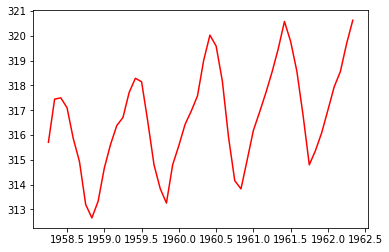
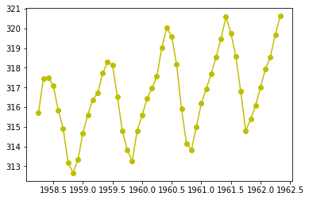
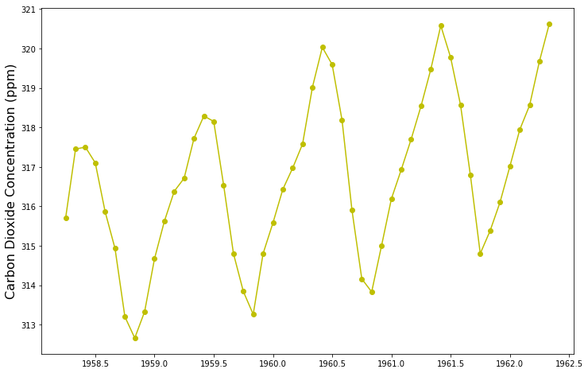
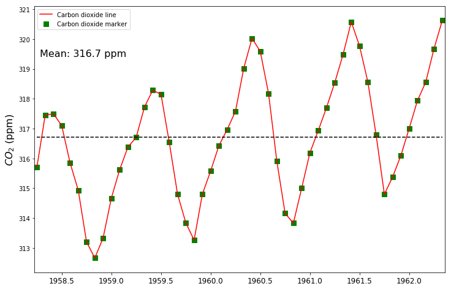

# Plotting with Matplotlib

Module describing common plots and settings in Matplotlib

- Current version 3.0.2 (Python 3 only)
- One of the most widely used modules
- Inspired in Matlab

The "pyplot" sub-module is a high-level library of plotting commands very similar to Matlab syntax.

Pyplot function list: https://matplotlib.org/api/_as_gen/matplotlib.pyplot.html

User's guide: https://matplotlib.org/users/index.html

Go to: Tutorial -> Introductory -> Sample plots matplotlib


```python
# Step 1: Import modules
import pandas as pd
import numpy as np
import matplotlib.pyplot as plt
%matplotlib inline

```


```python
dirname = '/Users/andrespatrignani/Dropbox/Teaching/Scientific programming/introcoding-spring-2019/Datasets/'
filename = 'mauna_loa_co2.csv'

```


```python
df = pd.read_csv(dirname + filename)
df.head(5)

```


<div>
<style scoped>
    .dataframe tbody tr th:only-of-type {
        vertical-align: middle;
    }

    .dataframe tbody tr th {
        vertical-align: top;
    }

    .dataframe thead th {
        text-align: right;
    }
</style>
<table border="1" class="dataframe">
  <thead>
    <tr style="text-align: right;">
      <th></th>
      <th>year</th>
      <th>month</th>
      <th>co2_ppm</th>
    </tr>
  </thead>
  <tbody>
    <tr>
      <th>0</th>
      <td>1958</td>
      <td>3</td>
      <td>315.71</td>
    </tr>
    <tr>
      <th>1</th>
      <td>1958</td>
      <td>4</td>
      <td>317.45</td>
    </tr>
    <tr>
      <th>2</th>
      <td>1958</td>
      <td>5</td>
      <td>317.50</td>
    </tr>
    <tr>
      <th>3</th>
      <td>1958</td>
      <td>6</td>
      <td>317.10</td>
    </tr>
    <tr>
      <th>4</th>
      <td>1958</td>
      <td>7</td>
      <td>315.86</td>
    </tr>
  </tbody>
</table>
</div>


```python
# Calculate a decimal year so that we can plot the monthly data
decimal_date = df.year + df.month/12
df['decimal_date'] = df.year + df.month/12
df.head(5) # Let's check that our computation generated the desirable output

```


<div>
<style scoped>
    .dataframe tbody tr th:only-of-type {
        vertical-align: middle;
    }

    .dataframe tbody tr th {
        vertical-align: top;
    }

    .dataframe thead th {
        text-align: right;
    }
</style>
<table border="1" class="dataframe">
  <thead>
    <tr style="text-align: right;">
      <th></th>
      <th>year</th>
      <th>month</th>
      <th>co2_ppm</th>
      <th>decimal_date</th>
    </tr>
  </thead>
  <tbody>
    <tr>
      <th>0</th>
      <td>1958</td>
      <td>3</td>
      <td>315.71</td>
      <td>1958.250000</td>
    </tr>
    <tr>
      <th>1</th>
      <td>1958</td>
      <td>4</td>
      <td>317.45</td>
      <td>1958.333333</td>
    </tr>
    <tr>
      <th>2</th>
      <td>1958</td>
      <td>5</td>
      <td>317.50</td>
      <td>1958.416667</td>
    </tr>
    <tr>
      <th>3</th>
      <td>1958</td>
      <td>6</td>
      <td>317.10</td>
      <td>1958.500000</td>
    </tr>
    <tr>
      <th>4</th>
      <td>1958</td>
      <td>7</td>
      <td>315.86</td>
      <td>1958.583333</td>
    </tr>
  </tbody>
</table>
</div>


# The Plot Command

A more generic method of creating line and scatter plots. You can use Matlab-like syntax.


```python
plt.plot(decimal_date, df.co2_ppm,'-r')
plt.show()
```


```python
#plt.figure(figsize=(8,5))
plt.plot(decimal_date[0:50], df.co2_ppm[0:50],'-r')
plt.show()
```





```python
plt.plot(decimal_date[0:50], df.co2_ppm[0:50],'-o')
plt.show()
```


```python
plt.plot(decimal_date[0:50], df.co2_ppm[0:50],'-oy')
plt.show()
```





```python
# Print list of parameters that you can modify
#print(plt.rcParamsDefault) 
print(plt.rcParams.items) 
```


```python
plt.figure(figsize=(12,8))
plt.plot(decimal_date[0:50], df.co2_ppm[0:50],'-oy')
plt.ylabel('Carbon Dioxide Concentration (ppm)', fontsize=16)

# Parameters
plt.rcParams['axes.grid'] = True;
plt.rcParams['grid.color'] = 'k'
plt.rcParams['xtick.labelsize'] = 12.0
plt.rcParams['axes.facecolor'] = 'w'
plt.rcParams['axes.spines.top'] = True
plt.show()

```





# Scatter plot

**Syntax**

matplotlib.pyplot.scatter(x, y, s=None, c=None, marker=None, cmap=None, norm=None, vmin=None, vmax=None, alpha=None, linewidths=None, verts=None, edgecolors=None, *, data=None, **kwargs)

Source:https://matplotlib.org/api/_as_gen/matplotlib.pyplot.scatter.html#matplotlib.pyplot.scatter

Go to link and explore the different scatter options


```python
# Plot the first 50 values
```


```python
# Examples that modify additional figure properties
plt.figure(figsize=(12,8))
plt.plot(decimal_date[0:50], df.co2_ppm[0:50],'-r')
plt.scatter(decimal_date[0:50], df.co2_ppm[0:50], s=55, marker='s', facecolors='g', edgecolors='g')
plt.ylabel('$CO_2$ (ppm)', fontsize=16)
plt.legend({'Carbon dioxide line','Carbon dioxide marker'})

plt.plot(decimal_date[0:50],np.ones(df.co2_ppm[0:50].size)*df.co2_ppm[0:50].mean() ,'--k')

plot_label = 'Mean: ' + str(round(df.co2_ppm[0:50].mean(),1)) + ' ppm'
plt.annotate(plot_label, xy=(65, 380), xycoords='figure points', fontsize=16)

plt.autoscale(enable=True, axis='x', tight=True)

plt.rcParams['axes.grid'] = False;
plt.rcParams['grid.color'] = 'k'
plt.rcParams['xtick.labelsize'] = 12.0
plt.rcParams['axes.facecolor'] = 'w'
plt.rcParams['axes.spines.top'] = True
plt.show()

```





This is the simplest scatter plot we can generate. It's still missing axis labels and probably a smaller marker size since we can hardly see any data. In the following steps we will write few more commands to improve the figure.

Now it's a little better. There are many more figure, axes, series, and label properties that we can modify to change this figure. Below I provide some examples on how to change some additional properties. Of course, for any given plot, you will typically customize several, but not all properties. 

## Styles


```python
# Advanced settings using styles
# Gallery 1 at: https://matplotlib.org/gallery/style_sheets/style_sheets_reference.html
# Gallery 2 at: https://tonysyu.github.io/raw_content/matplotlib-style-gallery/gallery.html
print(plt.style.available)
```


```python
plt.style.use('ggplot') # Use plt.style.use('default') to revert.
plt.plot(decimal_date[0:50], data.co2_ppm[0:50],'ro')
plt.show()
```


```python
plt.style.use('default') # Use plt.style.use('default') to revert.
plt.plot(decimal_date[0:50], data.co2_ppm[0:50],'ro')
plt.show()
```

# Save figure

savefig(fname, dpi=None, facecolor='w', edgecolor='w',
        orientation='portrait', papertype=None, format=None,
        transparent=False, bbox_inches=None, pad_inches=0.1,
        frameon=None, metadata=None)
        
Source: https://matplotlib.org/api/_as_gen/matplotlib.pyplot.savefig.html


```python
plt.plot(decimal_date[0:50], data.co2_ppm[0:50],'-o')
plt.savefig('examplefig.png', dpi=200)
```
