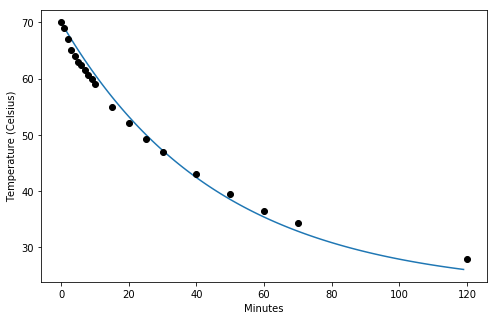

# Newton's Law of Cooling

The model states that the rate of cooling is proportional to the temperature difference between the object of interest and the ambient temperature.

$$\frac{dT}{dt}=-K(T_{obj} - T_{amb}) $$

THe equation can be solved analytically or numerically. To practice `for loops` we will implement the solution numerically by discretizing the equation into 1 minute intervals.

$\frac{dT}{dt}$ Rate of change of temperature

$-K$ COnstant of proportionality

$T_{obj}$ Temperature of the object (or fluid)

$T_{amb}$ Ambient temperature. Assumed to be constant and not affected by the object's temperature


```python
T_cup = [70]
T_amb = 22.5
dt = 1 # minutes
period = 120 # minutes
K = 0.0215

for t in range(1,period):
    dT = -K*(T_cup[t-1] - T_amb)*dt # Change in temperature of object
    T_cup_new = T_cup[t-1] + dT # 
    T_cup.append(T_cup_new)

```


```python
# Observations using hot water in a regular ceramic mug
T_obs = [70,69,67,65,64,63,62.5,61.5,60.7,60,59,55,52.1,49.3,47,43,39.5,36.5,34.3,28]
t_obs = [0,1,2,3,4,5,6,7,8,9,10,15,20,25,30,40,50,60,70,120]
```


```python
import matplotlib.pyplot as plt
%matplotlib inline

time_points = range(period)
plt.figure(figsize=(8,5))
plt.plot(time_points, T_cup)
plt.plot(t_obs, T_obs, 'ok')  
plt.xlabel('Minutes')
plt.ylabel('Temperature (Celsius)')
#plt.savefig('andres_patrignani.jpg') # Save figure before rendering to avoid blank image
plt.show()

```




