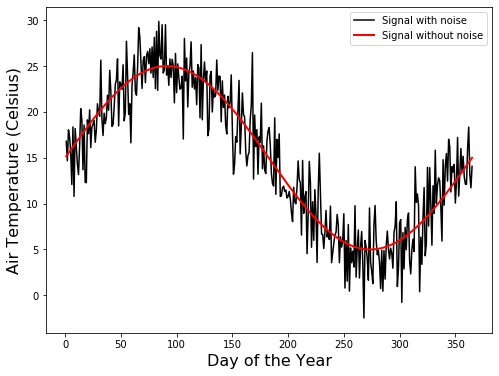

# Noisy Wave

Remember that one revolution is equal to 2$\pi$ radians, which is equal to 365 days.

A simple sine wave oscillates around the mean temperature $T_{avg}$ with amplitude $A$.


```python
import numpy as np
import matplotlib.pyplot as plt

```


```python
# Define wave inputs
T_avg = 15              # Annual average [Celsius]
A = 10                  # Annual amplitude [Celsius]
doy = np.arange(1,366)  # Vector of days of the year

```


```python
# Generate x and y axis
x = 2 * np.pi * doy/365     # Convert doy into pi-radians 
y = T_avg + A*np.sin(x) # Sine wave

```

Now we will add random noise from a normal distribution of zero mean and standard deviation of 3 degrees Celsius.


```python
# Add random noise
noise = np.random.normal(0, 3, x.size)  # White noise having zero mean
y_noisy = y + noise

```

>Run the previous cell again to obtain a slightly different set of random numbers and then run the next cell to display the new curve in the chart. You can merge both cells to play with the code using `ctrl + Enter`.


```python
# Plot wave
plt.figure(figsize=(8,6))
plt.plot(doy, y_noisy, '-k', label="Signal with noise")
plt.plot(doy, y, '-r', linewidth=2, label="Signal without noise")
plt.xlabel('Day of the Year', size=16)
plt.ylabel('Air Temperature (Celsius)', size=16)
plt.legend()
plt.show()

```




