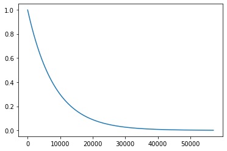

# Radiocarbon dating

Radiocarbon is an effective method for dating archaeological, geological and hydrogeological carbonaceous samples. The half-life for $^{14}C$ is approximately 5,730 years. This means that after 5,730 years the amount of 14C in a sample is reduced to about 50% of its original amount. The $^{14}C$ isotope is only useful for dating fossils up to about 50,000 years old. Fossils older than 50,000 years may have an undetectable amount of $^{14}C$. 

>Half-life is then defined as "the amount of time that it takes for an initial amount of a radioactive isotope to be reduced by 50%. Or in fewer words, when t = 5700, there is half the initial amount of $^{14}C$"

$$ N(t) = N_0 \, e^{ (-kt) }$$


Based on this notion, the half-life can be derived from the following expression:

$$ \frac{N_0}{2} = N_0 \, e^{ (-kt) }$$


Solving for $k$ we obtain:

$$ k = \frac{ln(1/2)}{5730} = -0.000121$$

The value of $k$ is different for different isotopes.

The method assumes carbonaceous materials and also assumes that the level of 14C in the atmosphere has remained constant over time. A limitation of this method is that samples older than that have insufficient 14C to be measurable.

The initial level of $^{14}C$ for the calculation can be obtained from live or dead tree-ring data, or from cave deposits.

Annual tree rings can provide information on past environmental conditions. The only quantity which can be expected to be largely independent of the geographic location is the radiocarbon content, the $^{14}C$/$^{12}C$ ratio of the carbon in the wood (Suess, 1980). The rings of tree trunks such as Bristlecone pine (*Pinus aristata*) found in the USA and Oak (*Quercus sp.*) found in Ireland and Germany are often used as a reference. 

> Willard Libby received the Nobel Prize in chemistry in 1960 for inventing radiocarbon dating.

## Elapsed time from proportion of remaining Carbon 14
Assume that a recently found fossil has a total of 19 grams of $^{14}C$ and that the 


```python
import numpy as np
import matplotlib.pyplot as plt

```


```python
k = -0.000121
radiocarbon = lambda N,N0: np.log(N/N0)/k

N0 = 45
N = 13
sigma = radiocarbon(N,N0)
print(round(sigma),'years')

```

    10262.0 years


```python
fraction_C14 = np.arange(0,1,0.001)
years = np.log(fraction_C14)/-0.000121

plt.plot(years,fraction_C14)
plt.show()

```

    /opt/anaconda3/lib/python3.7/site-packages/ipykernel_launcher.py:2: RuntimeWarning: divide by zero encountered in log
      





## Drills

- Write a code that illustrates that the method cannot be used to approximate the age of fossils beyond 50,000 years.

- Write a function that finds the percent of Carbon 14 remaining after a given number of years.


## References

Currie, L.A., 2004. The remarkable metrological history of radiocarbon dating [II]. Journal of Research of the National Institute of Standards and Technology, 109(2), p.185.

Libby, W.F., 1961. Radiocarbon dating. Science, 133(3453), pp.621-629.

Libby, W.F., 1970. Radiocarbon dating. Philosophical Transactions of the Royal Society of London. Series A, Mathematical and Physical Sciences, 269(1193), pp.1-10.

Suess, H.E., 1980. The radiocarbon record in tree rings of the last 8000 years. Radiocarbon, 22(2), pp.200-209.

