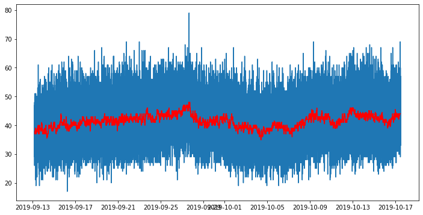

# Denoising Cosmic-Ray Neutron Signal

A signal obtained from a cosmic-ray neutron detector is typically noisy due to the random nature of the collisions with the instrument. Larger instruments that integrate neutron counts for longer periods of time are typically less noisy than smaller instruments that measure counts every few minutes or hours.

In this exercise we are using the signal from a stationary neutron dectector deployed at the Konza Prairie. This information is used to monitor soil moisture content in the root-zone.


```python
# Import modules
import pandas as pd
import matplotlib.pyplot as plt
from scipy import signal

```


```python
# Read data
df = pd.read_csv("../datasets/neutron_counts.csv")
df.head()

```


<div>
<style scoped>
    .dataframe tbody tr th:only-of-type {
        vertical-align: middle;
    }

    .dataframe tbody tr th {
        vertical-align: top;
    }

    .dataframe thead th {
        text-align: right;
    }
</style>
<table border="1" class="dataframe">
  <thead>
    <tr style="text-align: right;">
      <th></th>
      <th>TIMESTAMP</th>
      <th>RECORD</th>
      <th>D1</th>
      <th>D2</th>
      <th>D3</th>
      <th>D4</th>
    </tr>
  </thead>
  <tbody>
    <tr>
      <th>0</th>
      <td>9/13/19 4:28</td>
      <td>111836</td>
      <td>40</td>
      <td>34</td>
      <td>40</td>
      <td>28</td>
    </tr>
    <tr>
      <th>1</th>
      <td>9/13/19 4:29</td>
      <td>111837</td>
      <td>42</td>
      <td>50</td>
      <td>46</td>
      <td>45</td>
    </tr>
    <tr>
      <th>2</th>
      <td>9/13/19 4:30</td>
      <td>111838</td>
      <td>32</td>
      <td>33</td>
      <td>39</td>
      <td>46</td>
    </tr>
    <tr>
      <th>3</th>
      <td>9/13/19 4:31</td>
      <td>111839</td>
      <td>37</td>
      <td>38</td>
      <td>38</td>
      <td>43</td>
    </tr>
    <tr>
      <th>4</th>
      <td>9/13/19 4:32</td>
      <td>111840</td>
      <td>32</td>
      <td>32</td>
      <td>38</td>
      <td>44</td>
    </tr>
  </tbody>
</table>
</div>


```python
# Convert dates to Pandas datetime
df["TIMESTAMP"] = pd.to_datetime(df["TIMESTAMP"])

```


```python
plt.figure(figsize=(12,6))
plt.plot(df["TIMESTAMP"], df["D1"])
plt.show()
```


```python
plt.figure()
plt.hist(df['D1'], bins=25)
plt.hist(df['D2'], bins=25, alpha=0.5)
plt.show()
```


```python
plt.figure(figsize=(12,6))
plt.plot(df["TIMESTAMP"], df["D1"])
plt.plot(df["TIMESTAMP"], df["D1"].rolling(window=100, center=True).median(), color='red' )
plt.show()
```





```python
# Compute sum of the four detectors for each timestamp
df["D_total"] = df[["D1","D2","D3","D4"]].sum(axis=1)

# Compute mean of the four detectors for each timestamp
df["D_mean"] = df[["D1","D2","D3","D4"]].mean(axis=1)

# Compute median of the four detectors for each timestamp
df["D_median"] = df[["D1","D2","D3","D4"]].median(axis=1)

# Examine subset
df.head()
```


<div>
<style scoped>
    .dataframe tbody tr th:only-of-type {
        vertical-align: middle;
    }

    .dataframe tbody tr th {
        vertical-align: top;
    }

    .dataframe thead th {
        text-align: right;
    }
</style>
<table border="1" class="dataframe">
  <thead>
    <tr style="text-align: right;">
      <th></th>
      <th>TIMESTAMP</th>
      <th>RECORD</th>
      <th>D1</th>
      <th>D2</th>
      <th>D3</th>
      <th>D4</th>
      <th>D_total</th>
      <th>D_mean</th>
      <th>D_median</th>
    </tr>
  </thead>
  <tbody>
    <tr>
      <th>0</th>
      <td>2019-09-13 04:28:00</td>
      <td>111836</td>
      <td>40</td>
      <td>34</td>
      <td>40</td>
      <td>28</td>
      <td>142</td>
      <td>35.50</td>
      <td>37.0</td>
    </tr>
    <tr>
      <th>1</th>
      <td>2019-09-13 04:29:00</td>
      <td>111837</td>
      <td>42</td>
      <td>50</td>
      <td>46</td>
      <td>45</td>
      <td>183</td>
      <td>45.75</td>
      <td>45.5</td>
    </tr>
    <tr>
      <th>2</th>
      <td>2019-09-13 04:30:00</td>
      <td>111838</td>
      <td>32</td>
      <td>33</td>
      <td>39</td>
      <td>46</td>
      <td>150</td>
      <td>37.50</td>
      <td>36.0</td>
    </tr>
    <tr>
      <th>3</th>
      <td>2019-09-13 04:31:00</td>
      <td>111839</td>
      <td>37</td>
      <td>38</td>
      <td>38</td>
      <td>43</td>
      <td>156</td>
      <td>39.00</td>
      <td>38.0</td>
    </tr>
    <tr>
      <th>4</th>
      <td>2019-09-13 04:32:00</td>
      <td>111840</td>
      <td>32</td>
      <td>32</td>
      <td>38</td>
      <td>44</td>
      <td>146</td>
      <td>36.50</td>
      <td>35.0</td>
    </tr>
  </tbody>
</table>
</div>


```python
# Apply a Savitzky-Golay filter
df["SGolay"] = signal.savgol_filter(df["D_total"], window_length=7, polyorder=2)
df.head()

```


<div>
<style scoped>
    .dataframe tbody tr th:only-of-type {
        vertical-align: middle;
    }

    .dataframe tbody tr th {
        vertical-align: top;
    }

    .dataframe thead th {
        text-align: right;
    }
</style>
<table border="1" class="dataframe">
  <thead>
    <tr style="text-align: right;">
      <th></th>
      <th>TIMESTAMP</th>
      <th>RECORD</th>
      <th>D1</th>
      <th>D2</th>
      <th>D3</th>
      <th>D4</th>
      <th>D_total</th>
      <th>D_mean</th>
      <th>D_median</th>
      <th>SGolay</th>
    </tr>
  </thead>
  <tbody>
    <tr>
      <th>0</th>
      <td>2019-09-13 04:28:00</td>
      <td>111836</td>
      <td>40</td>
      <td>34</td>
      <td>40</td>
      <td>28</td>
      <td>142</td>
      <td>35.50</td>
      <td>37.0</td>
      <td>152.880952</td>
    </tr>
    <tr>
      <th>1</th>
      <td>2019-09-13 04:29:00</td>
      <td>111837</td>
      <td>42</td>
      <td>50</td>
      <td>46</td>
      <td>45</td>
      <td>183</td>
      <td>45.75</td>
      <td>45.5</td>
      <td>158.142857</td>
    </tr>
    <tr>
      <th>2</th>
      <td>2019-09-13 04:30:00</td>
      <td>111838</td>
      <td>32</td>
      <td>33</td>
      <td>39</td>
      <td>46</td>
      <td>150</td>
      <td>37.50</td>
      <td>36.0</td>
      <td>160.500000</td>
    </tr>
    <tr>
      <th>3</th>
      <td>2019-09-13 04:31:00</td>
      <td>111839</td>
      <td>37</td>
      <td>38</td>
      <td>38</td>
      <td>43</td>
      <td>156</td>
      <td>39.00</td>
      <td>38.0</td>
      <td>159.952381</td>
    </tr>
    <tr>
      <th>4</th>
      <td>2019-09-13 04:32:00</td>
      <td>111840</td>
      <td>32</td>
      <td>32</td>
      <td>38</td>
      <td>44</td>
      <td>146</td>
      <td>36.50</td>
      <td>35.0</td>
      <td>149.428571</td>
    </tr>
  </tbody>
</table>
</div>


```python
plt.figure(figsize=(12,6))
plt.plot(df["TIMESTAMP"], df["D_total"], '-b', alpha=0.25)
plt.plot(df["TIMESTAMP"], df["SGolay"], color='g')
plt.xticks(rotation=30)
plt.ylabel("Total fast neutron counts per minute")
plt.show()

```


## References

Savitzky, A. and Golay, M.J., 1964. Smoothing and differentiation of data by simplified least squares procedures. Analytical chemistry, 36(8), pp.1627-1639.
