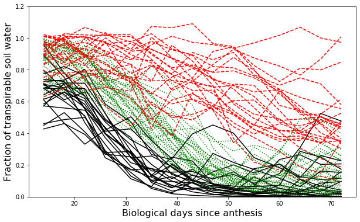

# Soil Water Deficits


```python
import pandas as pd
import numpy as np
import matplotlib.pyplot as plt
from sklearn.cluster import KMeans

```


```python
# Load data
df = pd.read_csv("../datasets/wheat_ftsw.csv")
df.head()

```


<div>
<style scoped>
    .dataframe tbody tr th:only-of-type {
        vertical-align: middle;
    }

    .dataframe tbody tr th {
        vertical-align: top;
    }

    .dataframe thead th {
        text-align: right;
    }
</style>
<table border="1" class="dataframe">
  <thead>
    <tr style="text-align: right;">
      <th></th>
      <th>climate_class</th>
      <th>city</th>
      <th>state</th>
      <th>year</th>
      <th>BD-14</th>
      <th>BD-18</th>
      <th>BD-22</th>
      <th>BD-26</th>
      <th>BD-31</th>
      <th>BD-35</th>
      <th>BD-39</th>
      <th>BD-43</th>
      <th>BD-47</th>
      <th>BD-51</th>
      <th>BD-55</th>
      <th>BD-60</th>
      <th>BD-64</th>
      <th>BD-68</th>
      <th>BD-72</th>
      <th>yield</th>
    </tr>
  </thead>
  <tbody>
    <tr>
      <th>0</th>
      <td>semi-arid</td>
      <td>Akron</td>
      <td>CO</td>
      <td>1986</td>
      <td>0.642</td>
      <td>0.707</td>
      <td>0.468</td>
      <td>0.279</td>
      <td>0.285</td>
      <td>0.134</td>
      <td>0.249</td>
      <td>0.225</td>
      <td>0.082</td>
      <td>0.039</td>
      <td>0.031</td>
      <td>0.024</td>
      <td>0.033</td>
      <td>0.068</td>
      <td>0.042</td>
      <td>2952</td>
    </tr>
    <tr>
      <th>1</th>
      <td>semi-arid</td>
      <td>Byers</td>
      <td>CO</td>
      <td>1989</td>
      <td>0.461</td>
      <td>0.486</td>
      <td>0.500</td>
      <td>0.330</td>
      <td>0.130</td>
      <td>0.062</td>
      <td>0.025</td>
      <td>0.092</td>
      <td>0.039</td>
      <td>0.044</td>
      <td>0.031</td>
      <td>0.010</td>
      <td>0.003</td>
      <td>0.007</td>
      <td>0.002</td>
      <td>1715</td>
    </tr>
    <tr>
      <th>2</th>
      <td>semi-arid</td>
      <td>Lamar</td>
      <td>CO</td>
      <td>1992</td>
      <td>0.796</td>
      <td>0.675</td>
      <td>0.582</td>
      <td>0.395</td>
      <td>0.278</td>
      <td>0.163</td>
      <td>0.155</td>
      <td>0.159</td>
      <td>0.111</td>
      <td>0.157</td>
      <td>0.080</td>
      <td>0.028</td>
      <td>0.034</td>
      <td>0.086</td>
      <td>0.096</td>
      <td>3437</td>
    </tr>
    <tr>
      <th>3</th>
      <td>semi-arid</td>
      <td>Sedgwick</td>
      <td>CO</td>
      <td>1996</td>
      <td>0.775</td>
      <td>0.821</td>
      <td>0.761</td>
      <td>0.523</td>
      <td>0.289</td>
      <td>0.136</td>
      <td>0.059</td>
      <td>0.088</td>
      <td>0.157</td>
      <td>0.201</td>
      <td>0.150</td>
      <td>0.206</td>
      <td>0.126</td>
      <td>0.108</td>
      <td>0.117</td>
      <td>4091</td>
    </tr>
    <tr>
      <th>4</th>
      <td>semi-arid</td>
      <td>Colby</td>
      <td>KS</td>
      <td>1999</td>
      <td>0.714</td>
      <td>0.611</td>
      <td>0.660</td>
      <td>0.397</td>
      <td>0.214</td>
      <td>0.177</td>
      <td>0.099</td>
      <td>0.054</td>
      <td>0.031</td>
      <td>0.012</td>
      <td>0.008</td>
      <td>0.004</td>
      <td>0.003</td>
      <td>0.002</td>
      <td>0.001</td>
      <td>1619</td>
    </tr>
  </tbody>
</table>
</div>


```python
X = df.iloc[:,4:-1].values
X.shape

```


    (75, 15)


```python
k = 3
groups = KMeans(n_clusters=k, random_state=0).fit_predict(X)
print(groups)

```

    [0 0 0 0 0 0 2 0 0 2 0 1 2 0 2 0 2 0 0 2 0 2 0 0 2 2 1 0 2 2 0 2 2 1 2 1 2
     2 1 2 1 2 0 1 2 1 0 2 2 2 1 2 1 0 2 2 1 1 1 1 1 2 1 1 1 2 2 2 2 1 2 1 1 1
     1]


```python
# Get cumulative biological days for plotting purposes
cbd = [np.float(col[3:]) for col in df.columns[4:-1]]
print(cbd)

```

    [14.0, 18.0, 22.0, 26.0, 31.0, 35.0, 39.0, 43.0, 47.0, 51.0, 55.0, 60.0, 64.0, 68.0, 72.0]


```python
# Add groups to DataFrame
df.insert(1,"Kgroup",groups)

```


```python
# Examine matching of Kgroups with known climate classification according to Aridity Index
for i in range(df.shape[0]):
    print(df.loc[i,"city"],': ', df.loc[i,"climate_class"], df.loc[i,"Kgroup"])
    
```

    Akron :  semi-arid 0
    Byers :  semi-arid 0
    Lamar :  semi-arid 0
    Sedgwick :  semi-arid 0
    Colby :  semi-arid 0
    Dodge City :  semi-arid 0
    Elkhart :  semi-arid 2
    Garden City :  semi-arid 0
    Goodland :  semi-arid 0
    Liberal :  semi-arid 2
    Ness City :  semi-arid 0
    Oakley :  semi-arid 1
    St. John :  semi-arid 2
    Tribune :  semi-arid 0
    Beaver :  semi-arid 2
    Boise City :  semi-arid 0
    Crosbyton :  semi-arid 2
    Dalhart :  semi-arid 0
    Dumas :  semi-arid 0
    Haskell :  semi-arid 2
    Hereford :  semi-arid 0
    Muleshoe :  semi-arid 2
    Perryton :  semi-arid 0
    Plainview :  semi-arid 0
    Quanah :  semi-arid 2
    Ellsworth :  dry-subhumid 2
    Ellsworth :  dry-subhumid 1
    Great Bend :  dry-subhumid 0
    Greensburg :  dry-subhumid 2
    Kiowa :  dry-subhumid 2
    Meade :  dry-subhumid 0
    Medicine Lodge :  dry-subhumid 2
    Norton :  dry-subhumid 2
    Pratt :  dry-subhumid 1
    Salina :  dry-subhumid 2
    Scandia :  dry-subhumid 1
    Smith Center :  dry-subhumid 2
    Altus :  dry-subhumid 2
    Alva :  dry-subhumid 1
    Bessie :  dry-subhumid 2
    Elk City :  dry-subhumid 1
    Hobart :  dry-subhumid 2
    Putnam :  dry-subhumid 0
    Seiling :  dry-subhumid 1
    Tipton :  dry-subhumid 2
    Watonga :  dry-subhumid 1
    Woodward :  dry-subhumid 0
    Brownwood :  dry-subhumid 2
    Brownwood :  dry-subhumid 2
    Vernon :  dry-subhumid 2
    Hutchinson :  moist-subhumid 1
    Hutchinson :  moist-subhumid 2
    Manhattan :  moist-subhumid 1
    McPherson :  moist-subhumid 0
    Newton :  moist-subhumid 2
    Newton :  moist-subhumid 2
    Ottawa :  moist-subhumid 1
    Parsons :  moist-subhumid 1
    Rossville :  moist-subhumid 1
    Rossville :  moist-subhumid 1
    Silver Lake :  moist-subhumid 1
    Windfield :  moist-subhumid 2
    Blackwell :  moist-subhumid 1
    Blackwell :  moist-subhumid 1
    Haskell :  moist-subhumid 1
    Kingfisher :  moist-subhumid 2
    Lahoma :  moist-subhumid 2
    Lahoma :  moist-subhumid 2
    Marshall :  moist-subhumid 2
    Medford :  moist-subhumid 1
    Miami :  moist-subhumid 2
    Miami :  moist-subhumid 1
    Stillwater :  moist-subhumid 1
    Paris :  moist-subhumid 1
    Paris :  moist-subhumid 1


```python
plt.figure(figsize=(10,6))

for i,g in enumerate(groups):
    if g == 0: 
        plt.plot(cbd, df.iloc[i,5:-1], '-k')
    elif g == 1: 
        plt.plot(cbd, df.iloc[i,5:-1], '--r')
    elif g == 2: 
        plt.plot(cbd, df.iloc[i,5:-1], ':g')
        
plt.xlabel('Biological days since anthesis', size=16)
plt.ylabel('Fraction of transpirable soil water', size=16)
plt.ylim(0,1.2)
plt.show()
```





## References

Sciarresi, C., Patrignani, A., Soltani, A., Sinclair, T. and Lollato, R.P., 2019. Plant traits to increase winter wheat yield in semiarid and subhumid environments. Agronomy Journal, 111(4), pp.1728-1740.
