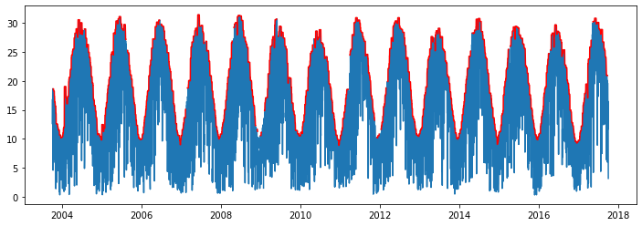

# Solar Radiation

The incident solar radiation on given location is highly influenced by the latitudinal position. In this exercise we examine a method to derive the estimated maximum solar irradiance for each day of the year from a timeseries of observations.


```python
# Import modules
import pandas as pd
import numpy as np
import matplotlib.pyplot as plt
from scipy.optimize import curve_fit

```


```python
# Load sample data
df = pd.read_csv("../datasets/KS_Manhattan_6_SSW.csv")
df.head()

```


<div>
<style scoped>
    .dataframe tbody tr th:only-of-type {
        vertical-align: middle;
    }

    .dataframe tbody tr th {
        vertical-align: top;
    }

    .dataframe thead th {
        text-align: right;
    }
</style>
<table border="1" class="dataframe">
  <thead>
    <tr style="text-align: right;">
      <th></th>
      <th>WBANNO</th>
      <th>LST_DATE</th>
      <th>CRX_VN</th>
      <th>LONGITUDE</th>
      <th>LATITUDE</th>
      <th>T_DAILY_MAX</th>
      <th>T_DAILY_MIN</th>
      <th>T_DAILY_MEAN</th>
      <th>T_DAILY_AVG</th>
      <th>P_DAILY_CALC</th>
      <th>...</th>
      <th>SOIL_MOISTURE_5_DAILY</th>
      <th>SOIL_MOISTURE_10_DAILY</th>
      <th>SOIL_MOISTURE_20_DAILY</th>
      <th>SOIL_MOISTURE_50_DAILY</th>
      <th>SOIL_MOISTURE_100_DAILY</th>
      <th>SOIL_TEMP_5_DAILY</th>
      <th>SOIL_TEMP_10_DAILY</th>
      <th>SOIL_TEMP_20_DAILY</th>
      <th>SOIL_TEMP_50_DAILY</th>
      <th>SOIL_TEMP_100_DAILY</th>
    </tr>
  </thead>
  <tbody>
    <tr>
      <th>0</th>
      <td>53974</td>
      <td>20031001</td>
      <td>1.201</td>
      <td>-96.61</td>
      <td>39.1</td>
      <td>-9999.0</td>
      <td>-9999.0</td>
      <td>-9999.0</td>
      <td>-9999.0</td>
      <td>-9999.0</td>
      <td>...</td>
      <td>-99.0</td>
      <td>-99.0</td>
      <td>-99.0</td>
      <td>-99</td>
      <td>-99</td>
      <td>-9999.0</td>
      <td>-9999.0</td>
      <td>-9999.0</td>
      <td>-9999.0</td>
      <td>-9999.0</td>
    </tr>
    <tr>
      <th>1</th>
      <td>53974</td>
      <td>20031002</td>
      <td>1.201</td>
      <td>-96.61</td>
      <td>39.1</td>
      <td>18.9</td>
      <td>2.5</td>
      <td>10.7</td>
      <td>11.7</td>
      <td>0.0</td>
      <td>...</td>
      <td>-99.0</td>
      <td>-99.0</td>
      <td>-99.0</td>
      <td>-99</td>
      <td>-99</td>
      <td>-9999.0</td>
      <td>-9999.0</td>
      <td>-9999.0</td>
      <td>-9999.0</td>
      <td>-9999.0</td>
    </tr>
    <tr>
      <th>2</th>
      <td>53974</td>
      <td>20031003</td>
      <td>1.201</td>
      <td>-96.61</td>
      <td>39.1</td>
      <td>22.6</td>
      <td>8.1</td>
      <td>15.4</td>
      <td>14.8</td>
      <td>0.0</td>
      <td>...</td>
      <td>-99.0</td>
      <td>-99.0</td>
      <td>-99.0</td>
      <td>-99</td>
      <td>-99</td>
      <td>-9999.0</td>
      <td>-9999.0</td>
      <td>-9999.0</td>
      <td>-9999.0</td>
      <td>-9999.0</td>
    </tr>
    <tr>
      <th>3</th>
      <td>53974</td>
      <td>20031004</td>
      <td>1.201</td>
      <td>-96.61</td>
      <td>39.1</td>
      <td>22.6</td>
      <td>3.8</td>
      <td>13.2</td>
      <td>14.0</td>
      <td>0.0</td>
      <td>...</td>
      <td>-99.0</td>
      <td>-99.0</td>
      <td>-99.0</td>
      <td>-99</td>
      <td>-99</td>
      <td>-9999.0</td>
      <td>-9999.0</td>
      <td>-9999.0</td>
      <td>-9999.0</td>
      <td>-9999.0</td>
    </tr>
    <tr>
      <th>4</th>
      <td>53974</td>
      <td>20031005</td>
      <td>1.201</td>
      <td>-96.61</td>
      <td>39.1</td>
      <td>25.0</td>
      <td>10.6</td>
      <td>17.8</td>
      <td>17.3</td>
      <td>0.0</td>
      <td>...</td>
      <td>-99.0</td>
      <td>-99.0</td>
      <td>-99.0</td>
      <td>-99</td>
      <td>-99</td>
      <td>-9999.0</td>
      <td>-9999.0</td>
      <td>-9999.0</td>
      <td>-9999.0</td>
      <td>-9999.0</td>
    </tr>
  </tbody>
</table>
<p>5 rows × 28 columns</p>
</div>


```python
# Convert date string to pandas datetime format
df["LST_DATE"] = pd.to_datetime(df["LST_DATE"], format="%Y%m%d")
df["LST_DATE"].head() # CHeck our conversion.

```


    0   2003-10-01
    1   2003-10-02
    2   2003-10-03
    3   2003-10-04
    4   2003-10-05
    Name: LST_DATE, dtype: datetime64[ns]


```python
# Convert missing values represented as -9999 to NaN
df[df == -9999] = np.nan

```


```python
# Add year, month, and day of the year to summarize data in future steps.
df["YEAR"] = df["LST_DATE"].dt.year
df["MONTH"] = df["LST_DATE"].dt.month
df["DOY"] = df["LST_DATE"].dt.dayofyear

```


```python
# Observe trends in solar radiation data
plt.figure(figsize=(12,4))
plt.plot(df["LST_DATE"], df["SOLARAD_DAILY"])
plt.plot(df["LST_DATE"], df["SOLARAD_DAILY"].rolling(window=15, center=True).max(), '-r')
plt.show()

```





```python
# Compute maximum solar radiation (proxy for ideal, non-cloudy conditions)
solar_rad_max = df_grouped["SOLARAD_DAILY"].rolling(window=15, center=True).quantile(0.95)

```


```python
plt.figure(figsize=(12,4))
plt.plot(df_grouped.index, df_grouped["SOLARAD_DAILY"])
plt.plot(df_grouped.index, solar_rad_max, '-r')

plt.show()
```


