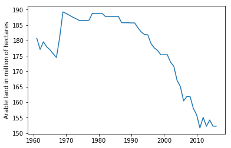

# Statistics module

A simple Python module to handle some basic statistics. It can also handle numpy arrays. For this exercise we will use data from FAO STATS about arable land in the US. The data set contains arable land data in millions of hectares from 1961 to 2016 for the USA. The abbreviated example only has eleven values from 2006 to 2016 rounded to the nearest million.


Visit official documentation at: <https://docs.python.org/3.4/library/statistics.html>


```python
import statistics as stats # Only mandatory module for this exercise
import numpy as np   # Optional
import pandas as pd  # Optional
import glob          # Optional
import matplotlib.pyplot as plt # Just for plotting the data after importing

```


```python
# Navigate to Datasets directory and load example file
root = '/Users/andrespatrignani/Dropbox/Teaching/Scientific programming/introcoding-spring-2019/'
glob.os.chdir(root + 'Datasets/')
df = pd.read_csv('faostats_usa_arable_land.csv')
df.head(5)
data = df['Value']

df.head(5)
```


<div>
<style scoped>
    .dataframe tbody tr th:only-of-type {
        vertical-align: middle;
    }

    .dataframe tbody tr th {
        vertical-align: top;
    }

    .dataframe thead th {
        text-align: right;
    }
</style>
<table border="1" class="dataframe">
  <thead>
    <tr style="text-align: right;">
      <th></th>
      <th>Domain</th>
      <th>Area</th>
      <th>Variable</th>
      <th>Year</th>
      <th>Unit</th>
      <th>Value</th>
    </tr>
  </thead>
  <tbody>
    <tr>
      <th>0</th>
      <td>Land Use</td>
      <td>United States of America</td>
      <td>Arable land</td>
      <td>1961</td>
      <td>1000000 ha</td>
      <td>180.630</td>
    </tr>
    <tr>
      <th>1</th>
      <td>Land Use</td>
      <td>United States of America</td>
      <td>Arable land</td>
      <td>1962</td>
      <td>1000000 ha</td>
      <td>177.095</td>
    </tr>
    <tr>
      <th>2</th>
      <td>Land Use</td>
      <td>United States of America</td>
      <td>Arable land</td>
      <td>1963</td>
      <td>1000000 ha</td>
      <td>179.574</td>
    </tr>
    <tr>
      <th>3</th>
      <td>Land Use</td>
      <td>United States of America</td>
      <td>Arable land</td>
      <td>1964</td>
      <td>1000000 ha</td>
      <td>177.966</td>
    </tr>
    <tr>
      <th>4</th>
      <td>Land Use</td>
      <td>United States of America</td>
      <td>Arable land</td>
      <td>1965</td>
      <td>1000000 ha</td>
      <td>177.000</td>
    </tr>
  </tbody>
</table>
</div>


```python
# Plot data
plt.figure()
plt.plot(df['Year'], df['Value'])
plt.ylabel('Arable land in million of hectares')
plt.show()
```





```python
# In case you don't want to load all the modules for a simple exercise 
# just use this variable. You can mute the cells above as a comment.


# import statistics as stats 
# data = [160,161,161,157,155,151,155,152,154,152,152]
```


```python
# Average
stats.mean(data)
```


    177.05856785714286


```python
# Sample standard deviation of data.
stats.stdev(data)       
```


    12.048125424089195


```python
# Variance
stats.variance(data)   
```


    145.15732623458445


```python
# Median 50th percentile of data.
stats.median(data)          
```


    180.815


```python
# Low median of data.
stats.median_low(data)      
```


    180.63


```python
# High median of data.
stats.median_high(data)     
```


    181.0


```python
# Median, or 50th percentile, of grouped data.
stats.median_grouped(data)  
```


    180.5


```python
# Most frequent data
stats.mode(data)            
```


    187.765


```python
# Population standard deviation of data.
stats.pstdev(data)          
```


    11.940068304798451


```python
# Population variance of data.
stats.pvariance(data)       
```


    142.56523112325257


