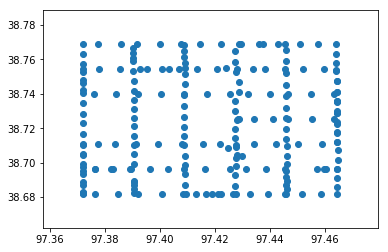
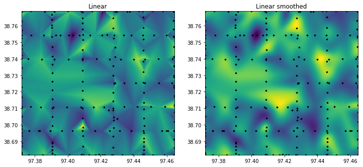

# **Spatial interpolation and smoothing**


```python
import numpy as np
import pandas as pd
import matplotlib.pyplot as plt
from scipy.interpolate import griddata
from scipy.ndimage import filters

```


```python
cosmos = pd.read_csv('../datasets/cosmos_rover.csv')
cosmos.head()

```


<div>
<style scoped>
    .dataframe tbody tr th:only-of-type {
        vertical-align: middle;
    }

    .dataframe tbody tr th {
        vertical-align: top;
    }

    .dataframe thead th {
        text-align: right;
    }
</style>
<table border="1" class="dataframe">
  <thead>
    <tr style="text-align: right;">
      <th></th>
      <th>RecordNum</th>
      <th>Date Time_UTC</th>
      <th>PTB110_mb</th>
      <th>T_CS215</th>
      <th>RH_CS215</th>
      <th>N1Cts</th>
      <th>N2Cts</th>
      <th>N3Cts</th>
      <th>N4Cts</th>
      <th>N5Cts</th>
      <th>N6Cts</th>
      <th>N7Cts</th>
      <th>N8Cts</th>
      <th>LatDec</th>
      <th>LongDec</th>
      <th>Alt_meters</th>
      <th>Speed_kmh</th>
    </tr>
  </thead>
  <tbody>
    <tr>
      <th>0</th>
      <td>1</td>
      <td>2017/08/10 13:15:00</td>
      <td>973.29</td>
      <td>21.7</td>
      <td>85.2</td>
      <td>35</td>
      <td>40</td>
      <td>37</td>
      <td>42</td>
      <td>39</td>
      <td>45</td>
      <td>33</td>
      <td>37</td>
      <td>38.68208</td>
      <td>97.37201</td>
      <td>389.3</td>
      <td>0.00</td>
    </tr>
    <tr>
      <th>1</th>
      <td>2</td>
      <td>2017/08/10 13:16:00</td>
      <td>973.31</td>
      <td>21.7</td>
      <td>86.9</td>
      <td>44</td>
      <td>44</td>
      <td>39</td>
      <td>36</td>
      <td>37</td>
      <td>36</td>
      <td>38</td>
      <td>38</td>
      <td>38.68213</td>
      <td>97.37201</td>
      <td>389.5</td>
      <td>0.00</td>
    </tr>
    <tr>
      <th>2</th>
      <td>3</td>
      <td>2017/08/10 13:17:00</td>
      <td>973.25</td>
      <td>21.6</td>
      <td>86.9</td>
      <td>38</td>
      <td>37</td>
      <td>47</td>
      <td>32</td>
      <td>42</td>
      <td>30</td>
      <td>42</td>
      <td>41</td>
      <td>38.68213</td>
      <td>97.37201</td>
      <td>389.5</td>
      <td>0.00</td>
    </tr>
    <tr>
      <th>3</th>
      <td>4</td>
      <td>2017/08/10 13:18:00</td>
      <td>972.55</td>
      <td>20.4</td>
      <td>89.4</td>
      <td>38</td>
      <td>46</td>
      <td>42</td>
      <td>39</td>
      <td>34</td>
      <td>42</td>
      <td>36</td>
      <td>36</td>
      <td>38.68692</td>
      <td>97.37201</td>
      <td>391.3</td>
      <td>51.28</td>
    </tr>
    <tr>
      <th>4</th>
      <td>5</td>
      <td>2017/08/10 13:19:00</td>
      <td>972.68</td>
      <td>19.6</td>
      <td>94.8</td>
      <td>36</td>
      <td>39</td>
      <td>39</td>
      <td>42</td>
      <td>30</td>
      <td>29</td>
      <td>43</td>
      <td>36</td>
      <td>38.69318</td>
      <td>97.37199</td>
      <td>391.3</td>
      <td>37.98</td>
    </tr>
  </tbody>
</table>
</div>


```python
# Display transect
plt.figure(figsize=(6,4))
plt.scatter(cosmos.LongDec, cosmos.LatDec)
plt.show()

```





```python
# Total distance using trapezoidal integration
total_distance = np.trapz(cosmos.Speed_kmh/60)
print('Total distance:',total_distance,'km')

```

    Total distance: 133.118 km


```python
# Total distance based on average speed and total driving time
np.mean(cosmos.Speed_kmh) * cosmos.shape[0]/60

```


```python
# Fast neutron counts
counts_detector1 = cosmos.N1Cts + cosmos.N2Cts + cosmos.N3Cts + cosmos.N4Cts
counts_detector2 = cosmos.N5Cts + cosmos.N6Cts + cosmos.N7Cts + cosmos.N8Cts
total_counts = counts_detector1 + counts_detector2

```


```python
# Generate grid
lon_min = np.min(cosmos.LongDec)
lon_max = np.max(cosmos.LongDec)
lon_vec = np.linspace(lon_min,lon_max, 500, endpoint=True)

lat_min = np.min(cosmos.LatDec)
lat_max = np.max(cosmos.LatDec)
lat_vec = np.linspace(lat_min,lat_max, 500, endpoint=True)

lon_grid, lat_grid = np.meshgrid(lon_vec, lat_vec)
print(lon_grid.shape)

```

    (500, 500)


```python
# Interpolation
points = (cosmos.LongDec.values,cosmos.LatDec.values)
values = total_counts
grid_counts = griddata(points, values, (lon_grid, lat_grid), method='linear', fill_value=np.mean(total_counts))

```


```python
# Smooth noisy 2D interpolation
grid_counts_smooth = filters.gaussian_filter(grid_counts,10)
#grid_counts_smooth = filters.median_filter(grid_counts, 25)

```


    (500, 500)


```python
plt.figure(figsize=(12,8))
plt.subplot(121)
plt.imshow(grid_counts, extent=(lon_min,lon_max,lat_min,lat_max))
plt.plot(cosmos.LongDec,cosmos.LatDec, 'k.', ms=5)
plt.title('Linear')

plt.subplot(122)
plt.imshow(grid_counts_smooth, extent=(lon_min,lon_max,lat_min,lat_max))
plt.plot(cosmos.LongDec,cosmos.LatDec, 'k.', ms=5)
plt.title('Linear smoothed')

plt.show()
```





The smoothing really changes the map helps to filter out much of the noise in the data. For isntance, the yellow blog in the middle of the map (around Lat=38.715 and Lon=-97.42) is a small town in Kansas named Gypsum, which yields more neutron counts due to impervious surfaces that prevent precipitation events from infiltrating into the soil.


```python

```
