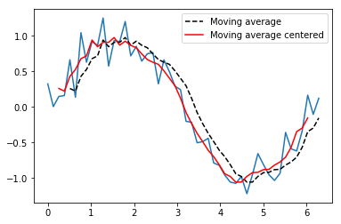
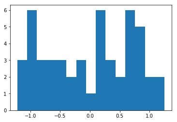

# Descriptive statistics

A set of basic and handy Numpy and Pandas functions to generate descriptive statistics.


```python
import numpy as np
import pandas as pd
import matplotlib.pyplot as plt
%matplotlib inline
```


```python
# For reproducibility
np.random.seed(1) 

# Create some synthetic data
x = np.linspace(0,2*np.pi)
y = np.sin(x)  + np.random.randn(x.size)*0.2
plt.plot(x,y)
plt.xlabel('X')
plt.ylabel('Y')
plt.show()
```


```python
# Simple stats
print(type(y))
print(y.mean())     # Mean
print(y.std())      # Standard deviation
print(y.var())      # Variance
print(np.median(y)) # Median
print(y.min())      # Minimum
print(y.max())      # Maximum
print(np.percentile(y,50))     # 50th percentile. Should equal to the median
print(np.percentile(y,[5,95])) # 5th and 95th percentile
```

    <class 'numpy.ndarray'>
    -0.0051029696015300755
    0.7215100159970891
    0.5205767031841197
    0.13062170652832145
    -1.2188411826762537
    1.2510894404456554
    0.13062170652832145
    [-1.04530309  0.99530595]


```python
# Pandas timeseries
ypd = pd.Series(y)
print(type(ypd))

```

    <class 'pandas.core.series.Series'>


```python
# Moving average
ypd_smooth = ypd.rolling(5).mean()
ypd_smooth_center = ypd.rolling(5, center=True).mean()

plt.plot(x,ypd)
plt.plot(x,ypd_smooth, '--k',label='Moving average')
plt.plot(x,ypd_smooth_center, '-r', label='Moving average centered')
plt.legend()
plt.show()
```





```python
# Histogram
plt.hist(y, bins=15) # add density=True to normalize the Y axis
plt.show()
```




