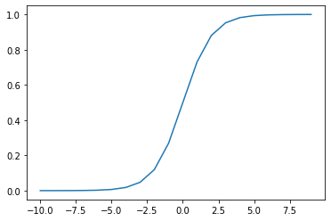

# Sympy

A module for symbolic math. In this short set of examples we will cover derivatives, numerical integration, and analytical integration.


```python
import glob
import sympy
import numpy as np
import pandas as pd
import matplotlib.pyplot as plt

```

## Derivation


```python
# Define symbolic variables
x = sympy.symbols('x')

```


```python
# First derivative (default, last function argument technically not needed)
first_derivative = sympy.diff(5*x**2 + 2*x + 115, x, 1)
first_derivative

```


$\displaystyle 10 x + 2$


```python
# Second derivative
second_derivative = sympy.diff(5*x**2 + 2*x + 115, x, 2)
second_derivative

```


$\displaystyle 10$


## Integration


```python
fun = lambda x: -0.003*x**2 + x + 100
lower_xlim = 0
upper_xlim = 300
x = np.arange(lower_xlim,upper_xlim)
y = fun(x)

plt.figure()
plt.plot(x,y)
plt.show()
```


## Numerical integration


```python
# Trapezoidal rule
numerical_int = np.trapz(y)
print(numerical_int)

```

    47869.4515


## Analytical integration


```python
x, y = sympy.symbols('x y')
sympy.integrate(fun(x), x)

```


$\displaystyle - 0.001 x^{3} + 0.5 x^{2} + 100.0 x$


```python
analytical_int = sympy.integrate(fun(x), (x,lower_xlim,upper_xlim))
print(analytical_int)

```

    48000.0000000000


```python
# Difference between analytical and numerical
error_int = analytical_int - numerical_int
relative_error = error_int / analytical_int * 100
print(relative_error)

```

    0.271976041666661


```python
sigmoid = lambda x: 1/(1+np.exp(-x))
lower_xlim = -10
upper_xlim = 10
x = np.arange(lower_xlim,upper_xlim)
y = sigmoid(x)

plt.figure()
plt.plot(x,y)
plt.show()
```




