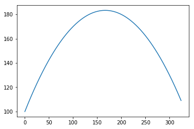

# Sympy

A module for symbolic math


```python
import sympy
```

## Derivation


```python
# Define symbolic variables
x = sympy.symbols('x')
```


```python
# First derivative (default, last function argument technically not needed)
first_derivative = sympy.diff(5*x**2 + 2*x + 115, x, 1)
first_derivative
```


    10*x + 2


```python
# Second derivative
second_derivative = sympy.diff(5*x**2 + 2*x + 115, x, 2)
second_derivative
```


    10


## Integration


```python
import numpy as np
import matplotlib.pyplot as plt
```


```python
fun = lambda x: -0.003*x**2 + x + 100
x = np.arange(0,325)
y = fun(x)
```


```python
plt.figure()
plt.plot(x,y)
plt.show()
```





```python
np.trapz(y)
```


    50875.613999999994


```python
import sympy
x, y = sympy.symbols('x y')
sympy.integrate(-0.003*x**2 + x + 100, x)
```


    -0.001*x**3 + 0.5*x**2 + 100.0*x


```python
sympy.integrate(-0.003*x**2 + x + 100, (x,0,325))
```


    50984.3750000000


