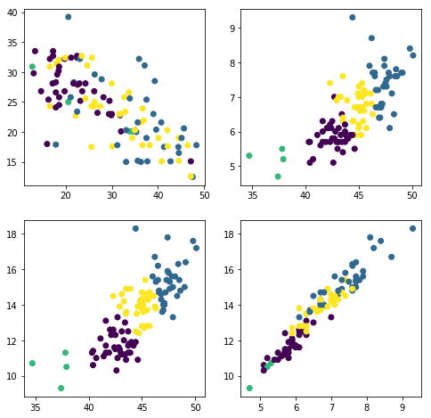
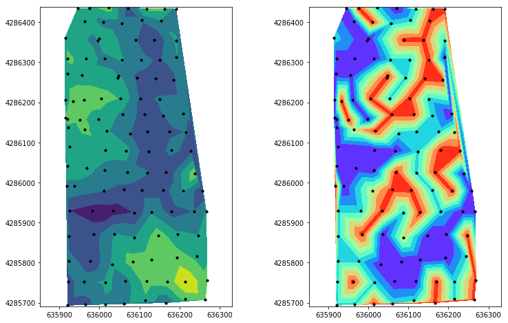

# Unsupervised clustering using K-means

In this exercise we will classify field management zones base on soil color and soil texture. Soil color is represented by the `Lab` color system and soil texture was determined by the Hydrometer method. The soil textural class was determined using the USDA-NRCS soil classification triangle.

The dataset contains four different soil textural classes.


```python
# Import modules
import numpy as np
import pandas as pd
import matplotlib.pyplot as plt
import glob

from sklearn.cluster import KMeans
from sklearn.datasets import make_blobs

```


```python
# Navigate to directory
glob.os.chdir("/Users/andrespatrignani/Dropbox/Teaching/Scientific programming/pynotes/datasets/")

```


```python
# Load data
data = pd.read_csv('field_spatial_variability.csv')

```


```python
# Top rows
data.head()

```


<div>
<style scoped>
    .dataframe tbody tr th:only-of-type {
        vertical-align: middle;
    }

    .dataframe tbody tr th {
        vertical-align: top;
    }

    .dataframe thead th {
        text-align: right;
    }
</style>
<table border="1" class="dataframe">
  <thead>
    <tr style="text-align: right;">
      <th></th>
      <th>latitude</th>
      <th>longitude</th>
      <th>X</th>
      <th>Y</th>
      <th>sand</th>
      <th>clay</th>
      <th>L</th>
      <th>a</th>
      <th>b</th>
      <th>textural_class</th>
    </tr>
  </thead>
  <tbody>
    <tr>
      <th>0</th>
      <td>38.71337</td>
      <td>-97.43272</td>
      <td>636266.5785</td>
      <td>4285928.184</td>
      <td>29.5</td>
      <td>25.2</td>
      <td>40.4</td>
      <td>5.1</td>
      <td>10.6</td>
      <td>Loam</td>
    </tr>
    <tr>
      <th>1</th>
      <td>38.71386</td>
      <td>-97.43394</td>
      <td>636159.5704</td>
      <td>4285980.746</td>
      <td>44.4</td>
      <td>17.5</td>
      <td>46.0</td>
      <td>7.9</td>
      <td>15.6</td>
      <td>Loam</td>
    </tr>
    <tr>
      <th>2</th>
      <td>38.71342</td>
      <td>-97.43600</td>
      <td>635981.2897</td>
      <td>4285928.857</td>
      <td>47.5</td>
      <td>12.5</td>
      <td>46.3</td>
      <td>7.7</td>
      <td>15.3</td>
      <td>Loam</td>
    </tr>
    <tr>
      <th>3</th>
      <td>38.71383</td>
      <td>-97.43282</td>
      <td>636257.0101</td>
      <td>4285979.083</td>
      <td>47.1</td>
      <td>15.1</td>
      <td>42.7</td>
      <td>7.0</td>
      <td>13.3</td>
      <td>Loam</td>
    </tr>
    <tr>
      <th>4</th>
      <td>38.71338</td>
      <td>-97.43371</td>
      <td>636180.4796</td>
      <td>4285927.821</td>
      <td>41.3</td>
      <td>17.5</td>
      <td>46.8</td>
      <td>7.2</td>
      <td>14.6</td>
      <td>Loam</td>
    </tr>
  </tbody>
</table>
</div>


```python
# Bottom rows
data.tail()

```


<div>
<style scoped>
    .dataframe tbody tr th:only-of-type {
        vertical-align: middle;
    }

    .dataframe tbody tr th {
        vertical-align: top;
    }

    .dataframe thead th {
        text-align: right;
    }
</style>
<table border="1" class="dataframe">
  <thead>
    <tr style="text-align: right;">
      <th></th>
      <th>latitude</th>
      <th>longitude</th>
      <th>X</th>
      <th>Y</th>
      <th>sand</th>
      <th>clay</th>
      <th>L</th>
      <th>a</th>
      <th>b</th>
      <th>textural_class</th>
    </tr>
  </thead>
  <tbody>
    <tr>
      <th>108</th>
      <td>38.71640</td>
      <td>-97.43465</td>
      <td>636093.0191</td>
      <td>4286261.561</td>
      <td>45.1</td>
      <td>19.0</td>
      <td>46.6</td>
      <td>7.2</td>
      <td>14.8</td>
      <td>Loam</td>
    </tr>
    <tr>
      <th>109</th>
      <td>38.71651</td>
      <td>-97.43664</td>
      <td>635919.7888</td>
      <td>4286270.812</td>
      <td>26.2</td>
      <td>26.8</td>
      <td>42.5</td>
      <td>5.8</td>
      <td>11.5</td>
      <td>Loam</td>
    </tr>
    <tr>
      <th>110</th>
      <td>38.71685</td>
      <td>-97.43610</td>
      <td>635966.0951</td>
      <td>4286309.345</td>
      <td>23.0</td>
      <td>28.1</td>
      <td>42.9</td>
      <td>5.7</td>
      <td>11.5</td>
      <td>Clay loam</td>
    </tr>
    <tr>
      <th>111</th>
      <td>38.71725</td>
      <td>-97.43575</td>
      <td>635995.7677</td>
      <td>4286354.253</td>
      <td>29.4</td>
      <td>23.0</td>
      <td>44.4</td>
      <td>5.9</td>
      <td>11.9</td>
      <td>Loam</td>
    </tr>
    <tr>
      <th>112</th>
      <td>38.71766</td>
      <td>-97.43558</td>
      <td>636009.7710</td>
      <td>4286400.005</td>
      <td>31.9</td>
      <td>23.0</td>
      <td>45.0</td>
      <td>6.2</td>
      <td>12.8</td>
      <td>Loam</td>
    </tr>
  </tbody>
</table>
</div>


```python
# Select variables
X = data[['L','a','b']]
X.head()

```


<div>
<style scoped>
    .dataframe tbody tr th:only-of-type {
        vertical-align: middle;
    }

    .dataframe tbody tr th {
        vertical-align: top;
    }

    .dataframe thead th {
        text-align: right;
    }
</style>
<table border="1" class="dataframe">
  <thead>
    <tr style="text-align: right;">
      <th></th>
      <th>L</th>
      <th>a</th>
      <th>b</th>
    </tr>
  </thead>
  <tbody>
    <tr>
      <th>0</th>
      <td>40.4</td>
      <td>5.1</td>
      <td>10.6</td>
    </tr>
    <tr>
      <th>1</th>
      <td>46.0</td>
      <td>7.9</td>
      <td>15.6</td>
    </tr>
    <tr>
      <th>2</th>
      <td>46.3</td>
      <td>7.7</td>
      <td>15.3</td>
    </tr>
    <tr>
      <th>3</th>
      <td>42.7</td>
      <td>7.0</td>
      <td>13.3</td>
    </tr>
    <tr>
      <th>4</th>
      <td>46.8</td>
      <td>7.2</td>
      <td>14.6</td>
    </tr>
  </tbody>
</table>
</div>


```python
# Clustering
# Same number of clusters as soil textures
y_pred = KMeans(n_clusters=4, random_state=0).fit_predict(X)
print(y_pred)

```

    [0 1 1 0 1 3 1 2 3 3 1 0 0 3 0 2 2 0 1 1 3 3 3 3 3 3 2 1 0 3 0 0 0 1 0 0 1
     1 1 0 3 3 0 0 3 3 0 1 0 3 0 1 0 3 1 1 3 0 3 0 1 1 1 1 1 0 1 3 1 3 1 3 3 1
     1 1 0 3 0 0 0 0 3 1 1 0 3 0 0 3 3 3 1 0 3 0 3 3 0 3 0 3 1 0 3 1 1 3 1 0 0
     0 3]


```python
# Append classification to original dataframe
data['clusters'] = y_pred
data

```


<div>
<style scoped>
    .dataframe tbody tr th:only-of-type {
        vertical-align: middle;
    }

    .dataframe tbody tr th {
        vertical-align: top;
    }

    .dataframe thead th {
        text-align: right;
    }
</style>
<table border="1" class="dataframe">
  <thead>
    <tr style="text-align: right;">
      <th></th>
      <th>latitude</th>
      <th>longitude</th>
      <th>X</th>
      <th>Y</th>
      <th>sand</th>
      <th>clay</th>
      <th>L</th>
      <th>a</th>
      <th>b</th>
      <th>textural_class</th>
      <th>clusters</th>
    </tr>
  </thead>
  <tbody>
    <tr>
      <th>0</th>
      <td>38.71337</td>
      <td>-97.43272</td>
      <td>636266.5785</td>
      <td>4285928.184</td>
      <td>29.5</td>
      <td>25.2</td>
      <td>40.4</td>
      <td>5.1</td>
      <td>10.6</td>
      <td>Loam</td>
      <td>0</td>
    </tr>
    <tr>
      <th>1</th>
      <td>38.71386</td>
      <td>-97.43394</td>
      <td>636159.5704</td>
      <td>4285980.746</td>
      <td>44.4</td>
      <td>17.5</td>
      <td>46.0</td>
      <td>7.9</td>
      <td>15.6</td>
      <td>Loam</td>
      <td>1</td>
    </tr>
    <tr>
      <th>2</th>
      <td>38.71342</td>
      <td>-97.43600</td>
      <td>635981.2897</td>
      <td>4285928.857</td>
      <td>47.5</td>
      <td>12.5</td>
      <td>46.3</td>
      <td>7.7</td>
      <td>15.3</td>
      <td>Loam</td>
      <td>1</td>
    </tr>
    <tr>
      <th>3</th>
      <td>38.71383</td>
      <td>-97.43282</td>
      <td>636257.0101</td>
      <td>4285979.083</td>
      <td>47.1</td>
      <td>15.1</td>
      <td>42.7</td>
      <td>7.0</td>
      <td>13.3</td>
      <td>Loam</td>
      <td>0</td>
    </tr>
    <tr>
      <th>4</th>
      <td>38.71338</td>
      <td>-97.43371</td>
      <td>636180.4796</td>
      <td>4285927.821</td>
      <td>41.3</td>
      <td>17.5</td>
      <td>46.8</td>
      <td>7.2</td>
      <td>14.6</td>
      <td>Loam</td>
      <td>1</td>
    </tr>
    <tr>
      <th>5</th>
      <td>38.71290</td>
      <td>-97.43597</td>
      <td>635984.8836</td>
      <td>4285871.196</td>
      <td>25.6</td>
      <td>17.5</td>
      <td>46.2</td>
      <td>6.8</td>
      <td>13.9</td>
      <td>Silt loam</td>
      <td>3</td>
    </tr>
    <tr>
      <th>6</th>
      <td>38.71344</td>
      <td>-97.43665</td>
      <td>635924.7348</td>
      <td>4285930.112</td>
      <td>33.1</td>
      <td>15.0</td>
      <td>47.6</td>
      <td>7.3</td>
      <td>14.9</td>
      <td>Silt loam</td>
      <td>1</td>
    </tr>
    <tr>
      <th>7</th>
      <td>38.71280</td>
      <td>-97.43479</td>
      <td>636087.6742</td>
      <td>4285861.852</td>
      <td>20.6</td>
      <td>25.0</td>
      <td>37.4</td>
      <td>4.7</td>
      <td>9.3</td>
      <td>Silt loam</td>
      <td>2</td>
    </tr>
    <tr>
      <th>8</th>
      <td>38.71387</td>
      <td>-97.43455</td>
      <td>636106.5127</td>
      <td>4285980.949</td>
      <td>30.1</td>
      <td>17.6</td>
      <td>43.9</td>
      <td>6.9</td>
      <td>14.9</td>
      <td>Silt loam</td>
      <td>3</td>
    </tr>
    <tr>
      <th>9</th>
      <td>38.71283</td>
      <td>-97.43296</td>
      <td>636246.7359</td>
      <td>4285867.902</td>
      <td>26.3</td>
      <td>25.0</td>
      <td>44.5</td>
      <td>6.3</td>
      <td>13.5</td>
      <td>Loam</td>
      <td>3</td>
    </tr>
    <tr>
      <th>10</th>
      <td>38.71286</td>
      <td>-97.43667</td>
      <td>635924.0945</td>
      <td>4285865.718</td>
      <td>36.3</td>
      <td>15.0</td>
      <td>47.8</td>
      <td>7.7</td>
      <td>15.6</td>
      <td>Loam</td>
      <td>1</td>
    </tr>
    <tr>
      <th>11</th>
      <td>38.71221</td>
      <td>-97.43545</td>
      <td>636031.4056</td>
      <td>4285795.397</td>
      <td>16.3</td>
      <td>25.4</td>
      <td>41.9</td>
      <td>5.7</td>
      <td>11.3</td>
      <td>Silt loam</td>
      <td>0</td>
    </tr>
    <tr>
      <th>12</th>
      <td>38.71289</td>
      <td>-97.43538</td>
      <td>636036.2031</td>
      <td>4285870.963</td>
      <td>23.2</td>
      <td>25.2</td>
      <td>42.1</td>
      <td>6.1</td>
      <td>12.3</td>
      <td>Silt loam</td>
      <td>0</td>
    </tr>
    <tr>
      <th>13</th>
      <td>38.71341</td>
      <td>-97.43539</td>
      <td>636034.3478</td>
      <td>4285928.654</td>
      <td>47.1</td>
      <td>12.6</td>
      <td>42.3</td>
      <td>7.4</td>
      <td>14.5</td>
      <td>Loam</td>
      <td>3</td>
    </tr>
    <tr>
      <th>14</th>
      <td>38.71479</td>
      <td>-97.43558</td>
      <td>636015.2115</td>
      <td>4286081.513</td>
      <td>22.6</td>
      <td>27.9</td>
      <td>40.4</td>
      <td>5.7</td>
      <td>11.4</td>
      <td>Clay loam</td>
      <td>0</td>
    </tr>
    <tr>
      <th>15</th>
      <td>38.71387</td>
      <td>-97.43565</td>
      <td>636010.8690</td>
      <td>4285979.315</td>
      <td>33.9</td>
      <td>20.1</td>
      <td>34.7</td>
      <td>5.3</td>
      <td>10.7</td>
      <td>Loam</td>
      <td>2</td>
    </tr>
    <tr>
      <th>16</th>
      <td>38.71516</td>
      <td>-97.43327</td>
      <td>636215.3582</td>
      <td>4286126.007</td>
      <td>34.5</td>
      <td>20.1</td>
      <td>37.8</td>
      <td>5.5</td>
      <td>11.3</td>
      <td>Loam</td>
      <td>2</td>
    </tr>
    <tr>
      <th>17</th>
      <td>38.71337</td>
      <td>-97.43307</td>
      <td>636236.1462</td>
      <td>4285927.663</td>
      <td>32.0</td>
      <td>20.1</td>
      <td>41.1</td>
      <td>5.9</td>
      <td>12.1</td>
      <td>Loam</td>
      <td>0</td>
    </tr>
    <tr>
      <th>18</th>
      <td>38.71337</td>
      <td>-97.43478</td>
      <td>636087.4627</td>
      <td>4285925.121</td>
      <td>42.7</td>
      <td>15.1</td>
      <td>46.5</td>
      <td>7.6</td>
      <td>16.2</td>
      <td>Loam</td>
      <td>1</td>
    </tr>
    <tr>
      <th>19</th>
      <td>38.71474</td>
      <td>-97.43434</td>
      <td>636123.1215</td>
      <td>4286077.807</td>
      <td>37.7</td>
      <td>15.1</td>
      <td>49.8</td>
      <td>8.4</td>
      <td>17.6</td>
      <td>Loam</td>
      <td>1</td>
    </tr>
    <tr>
      <th>20</th>
      <td>38.71557</td>
      <td>-97.43444</td>
      <td>636112.8522</td>
      <td>4286169.766</td>
      <td>42.1</td>
      <td>17.6</td>
      <td>45.3</td>
      <td>7.4</td>
      <td>15.4</td>
      <td>Loam</td>
      <td>3</td>
    </tr>
    <tr>
      <th>21</th>
      <td>38.71426</td>
      <td>-97.43385</td>
      <td>636166.6368</td>
      <td>4286025.269</td>
      <td>40.8</td>
      <td>15.1</td>
      <td>43.1</td>
      <td>7.0</td>
      <td>14.6</td>
      <td>Loam</td>
      <td>3</td>
    </tr>
    <tr>
      <th>22</th>
      <td>38.71474</td>
      <td>-97.43313</td>
      <td>636228.3282</td>
      <td>4286079.606</td>
      <td>36.6</td>
      <td>17.8</td>
      <td>43.5</td>
      <td>6.3</td>
      <td>13.5</td>
      <td>Loam</td>
      <td>3</td>
    </tr>
    <tr>
      <th>23</th>
      <td>38.71476</td>
      <td>-97.43369</td>
      <td>636179.5996</td>
      <td>4286080.993</td>
      <td>36.3</td>
      <td>21.6</td>
      <td>43.3</td>
      <td>7.0</td>
      <td>14.2</td>
      <td>Loam</td>
      <td>3</td>
    </tr>
    <tr>
      <th>24</th>
      <td>38.71337</td>
      <td>-97.43430</td>
      <td>636129.1984</td>
      <td>4285925.834</td>
      <td>25.6</td>
      <td>24.3</td>
      <td>45.7</td>
      <td>6.8</td>
      <td>14.7</td>
      <td>Silt loam</td>
      <td>3</td>
    </tr>
    <tr>
      <th>25</th>
      <td>38.71522</td>
      <td>-97.43554</td>
      <td>636017.8743</td>
      <td>4286129.291</td>
      <td>24.3</td>
      <td>25.6</td>
      <td>45.5</td>
      <td>6.6</td>
      <td>13.7</td>
      <td>Silt loam</td>
      <td>3</td>
    </tr>
    <tr>
      <th>26</th>
      <td>38.71526</td>
      <td>-97.43616</td>
      <td>635963.8913</td>
      <td>4286132.809</td>
      <td>12.8</td>
      <td>30.9</td>
      <td>37.9</td>
      <td>5.2</td>
      <td>10.5</td>
      <td>Silty clay loam</td>
      <td>2</td>
    </tr>
    <tr>
      <th>27</th>
      <td>38.71515</td>
      <td>-97.43487</td>
      <td>636076.2617</td>
      <td>4286122.518</td>
      <td>33.1</td>
      <td>20.3</td>
      <td>48.1</td>
      <td>7.1</td>
      <td>15.6</td>
      <td>Loam</td>
      <td>1</td>
    </tr>
    <tr>
      <th>28</th>
      <td>38.71476</td>
      <td>-97.43499</td>
      <td>636066.5675</td>
      <td>4286079.061</td>
      <td>23.6</td>
      <td>26.8</td>
      <td>41.6</td>
      <td>6.3</td>
      <td>13.1</td>
      <td>Loam</td>
      <td>0</td>
    </tr>
    <tr>
      <th>29</th>
      <td>38.71390</td>
      <td>-97.43508</td>
      <td>636060.3730</td>
      <td>4285983.491</td>
      <td>44.5</td>
      <td>19.0</td>
      <td>44.8</td>
      <td>6.7</td>
      <td>14.2</td>
      <td>Loam</td>
      <td>3</td>
    </tr>
    <tr>
      <th>...</th>
      <td>...</td>
      <td>...</td>
      <td>...</td>
      <td>...</td>
      <td>...</td>
      <td>...</td>
      <td>...</td>
      <td>...</td>
      <td>...</td>
      <td>...</td>
      <td>...</td>
    </tr>
    <tr>
      <th>83</th>
      <td>38.71769</td>
      <td>-97.43448</td>
      <td>636105.3527</td>
      <td>4286404.968</td>
      <td>45.6</td>
      <td>20.6</td>
      <td>46.5</td>
      <td>7.7</td>
      <td>15.4</td>
      <td>Loam</td>
      <td>1</td>
    </tr>
    <tr>
      <th>84</th>
      <td>38.71762</td>
      <td>-97.43505</td>
      <td>636055.9273</td>
      <td>4286396.353</td>
      <td>40.7</td>
      <td>21.6</td>
      <td>47.9</td>
      <td>7.6</td>
      <td>15.0</td>
      <td>Loam</td>
      <td>1</td>
    </tr>
    <tr>
      <th>85</th>
      <td>38.71550</td>
      <td>-97.43666</td>
      <td>635919.9631</td>
      <td>4286158.700</td>
      <td>13.4</td>
      <td>33.5</td>
      <td>43.5</td>
      <td>5.4</td>
      <td>10.9</td>
      <td>Silty clay loam</td>
      <td>0</td>
    </tr>
    <tr>
      <th>86</th>
      <td>38.71645</td>
      <td>-97.43517</td>
      <td>636047.7125</td>
      <td>4286266.337</td>
      <td>31.6</td>
      <td>23.0</td>
      <td>45.0</td>
      <td>7.0</td>
      <td>14.3</td>
      <td>Loam</td>
      <td>3</td>
    </tr>
    <tr>
      <th>87</th>
      <td>38.71730</td>
      <td>-97.43571</td>
      <td>635999.1507</td>
      <td>4286359.861</td>
      <td>18.2</td>
      <td>29.6</td>
      <td>41.4</td>
      <td>5.6</td>
      <td>11.1</td>
      <td>Silty clay loam</td>
      <td>0</td>
    </tr>
    <tr>
      <th>88</th>
      <td>38.71798</td>
      <td>-97.43631</td>
      <td>635945.6955</td>
      <td>4286434.432</td>
      <td>13.1</td>
      <td>29.8</td>
      <td>43.4</td>
      <td>5.7</td>
      <td>11.2</td>
      <td>Silty clay loam</td>
      <td>0</td>
    </tr>
    <tr>
      <th>89</th>
      <td>38.71590</td>
      <td>-97.43650</td>
      <td>635933.1168</td>
      <td>4286203.327</td>
      <td>23.5</td>
      <td>32.7</td>
      <td>42.9</td>
      <td>6.9</td>
      <td>13.9</td>
      <td>Clay loam</td>
      <td>3</td>
    </tr>
    <tr>
      <th>90</th>
      <td>38.71793</td>
      <td>-97.43349</td>
      <td>636190.9719</td>
      <td>4286433.073</td>
      <td>36.9</td>
      <td>21.9</td>
      <td>44.9</td>
      <td>7.1</td>
      <td>14.3</td>
      <td>Loam</td>
      <td>3</td>
    </tr>
    <tr>
      <th>91</th>
      <td>38.71794</td>
      <td>-97.43382</td>
      <td>636162.2614</td>
      <td>4286433.692</td>
      <td>24.7</td>
      <td>31.1</td>
      <td>45.0</td>
      <td>6.1</td>
      <td>13.8</td>
      <td>Clay loam</td>
      <td>3</td>
    </tr>
    <tr>
      <th>92</th>
      <td>38.71794</td>
      <td>-97.43433</td>
      <td>636117.9200</td>
      <td>4286432.934</td>
      <td>37.1</td>
      <td>31.1</td>
      <td>47.4</td>
      <td>8.1</td>
      <td>17.8</td>
      <td>Clay loam</td>
      <td>1</td>
    </tr>
    <tr>
      <th>93</th>
      <td>38.71684</td>
      <td>-97.43351</td>
      <td>636191.3020</td>
      <td>4286312.083</td>
      <td>18.6</td>
      <td>24.5</td>
      <td>42.3</td>
      <td>5.7</td>
      <td>12.4</td>
      <td>Silt loam</td>
      <td>0</td>
    </tr>
    <tr>
      <th>94</th>
      <td>38.71798</td>
      <td>-97.43597</td>
      <td>635975.2563</td>
      <td>4286434.937</td>
      <td>30.0</td>
      <td>28.1</td>
      <td>43.5</td>
      <td>7.6</td>
      <td>14.9</td>
      <td>Clay loam</td>
      <td>3</td>
    </tr>
    <tr>
      <th>95</th>
      <td>38.71648</td>
      <td>-97.43623</td>
      <td>635955.4933</td>
      <td>4286268.092</td>
      <td>17.9</td>
      <td>28.3</td>
      <td>44.2</td>
      <td>5.9</td>
      <td>11.7</td>
      <td>Silty clay loam</td>
      <td>0</td>
    </tr>
    <tr>
      <th>96</th>
      <td>38.71725</td>
      <td>-97.43467</td>
      <td>636089.6679</td>
      <td>4286355.858</td>
      <td>35.0</td>
      <td>20.3</td>
      <td>45.6</td>
      <td>7.1</td>
      <td>14.3</td>
      <td>Loam</td>
      <td>3</td>
    </tr>
    <tr>
      <th>97</th>
      <td>38.71725</td>
      <td>-97.43413</td>
      <td>636136.6181</td>
      <td>4286356.660</td>
      <td>44.5</td>
      <td>15.2</td>
      <td>45.5</td>
      <td>7.2</td>
      <td>14.3</td>
      <td>Loam</td>
      <td>3</td>
    </tr>
    <tr>
      <th>98</th>
      <td>38.71593</td>
      <td>-97.43671</td>
      <td>635914.8013</td>
      <td>4286206.344</td>
      <td>18.6</td>
      <td>25.8</td>
      <td>43.7</td>
      <td>6.0</td>
      <td>11.7</td>
      <td>Silt loam</td>
      <td>0</td>
    </tr>
    <tr>
      <th>99</th>
      <td>38.71593</td>
      <td>-97.43455</td>
      <td>636102.6052</td>
      <td>4286209.552</td>
      <td>34.4</td>
      <td>19.0</td>
      <td>45.1</td>
      <td>6.7</td>
      <td>14.3</td>
      <td>Loam</td>
      <td>3</td>
    </tr>
    <tr>
      <th>100</th>
      <td>38.71684</td>
      <td>-97.43556</td>
      <td>636013.0644</td>
      <td>4286309.037</td>
      <td>30.0</td>
      <td>23.0</td>
      <td>43.3</td>
      <td>5.9</td>
      <td>12.0</td>
      <td>Loam</td>
      <td>0</td>
    </tr>
    <tr>
      <th>101</th>
      <td>38.71679</td>
      <td>-97.43398</td>
      <td>636150.5327</td>
      <td>4286305.836</td>
      <td>40.1</td>
      <td>19.0</td>
      <td>45.6</td>
      <td>7.1</td>
      <td>14.5</td>
      <td>Loam</td>
      <td>3</td>
    </tr>
    <tr>
      <th>102</th>
      <td>38.71722</td>
      <td>-97.43350</td>
      <td>636191.4502</td>
      <td>4286354.268</td>
      <td>33.9</td>
      <td>25.6</td>
      <td>46.9</td>
      <td>6.4</td>
      <td>13.6</td>
      <td>Loam</td>
      <td>1</td>
    </tr>
    <tr>
      <th>103</th>
      <td>38.71549</td>
      <td>-97.43576</td>
      <td>635998.2342</td>
      <td>4286158.927</td>
      <td>21.7</td>
      <td>28.1</td>
      <td>42.8</td>
      <td>6.0</td>
      <td>11.6</td>
      <td>Clay loam</td>
      <td>0</td>
    </tr>
    <tr>
      <th>104</th>
      <td>38.71634</td>
      <td>-97.43359</td>
      <td>636185.2954</td>
      <td>4286256.478</td>
      <td>38.2</td>
      <td>17.8</td>
      <td>45.1</td>
      <td>6.6</td>
      <td>13.6</td>
      <td>Loam</td>
      <td>3</td>
    </tr>
    <tr>
      <th>105</th>
      <td>38.71594</td>
      <td>-97.43512</td>
      <td>636053.0269</td>
      <td>4286209.815</td>
      <td>26.3</td>
      <td>29.6</td>
      <td>46.6</td>
      <td>6.7</td>
      <td>14.7</td>
      <td>Clay loam</td>
      <td>1</td>
    </tr>
    <tr>
      <th>106</th>
      <td>38.71680</td>
      <td>-97.43452</td>
      <td>636103.5633</td>
      <td>4286306.143</td>
      <td>35.6</td>
      <td>21.6</td>
      <td>47.5</td>
      <td>7.4</td>
      <td>15.8</td>
      <td>Loam</td>
      <td>1</td>
    </tr>
    <tr>
      <th>107</th>
      <td>38.71637</td>
      <td>-97.43411</td>
      <td>636140.0267</td>
      <td>4286259.034</td>
      <td>46.4</td>
      <td>17.8</td>
      <td>45.0</td>
      <td>7.3</td>
      <td>14.7</td>
      <td>Loam</td>
      <td>3</td>
    </tr>
    <tr>
      <th>108</th>
      <td>38.71640</td>
      <td>-97.43465</td>
      <td>636093.0191</td>
      <td>4286261.561</td>
      <td>45.1</td>
      <td>19.0</td>
      <td>46.6</td>
      <td>7.2</td>
      <td>14.8</td>
      <td>Loam</td>
      <td>1</td>
    </tr>
    <tr>
      <th>109</th>
      <td>38.71651</td>
      <td>-97.43664</td>
      <td>635919.7888</td>
      <td>4286270.812</td>
      <td>26.2</td>
      <td>26.8</td>
      <td>42.5</td>
      <td>5.8</td>
      <td>11.5</td>
      <td>Loam</td>
      <td>0</td>
    </tr>
    <tr>
      <th>110</th>
      <td>38.71685</td>
      <td>-97.43610</td>
      <td>635966.0951</td>
      <td>4286309.345</td>
      <td>23.0</td>
      <td>28.1</td>
      <td>42.9</td>
      <td>5.7</td>
      <td>11.5</td>
      <td>Clay loam</td>
      <td>0</td>
    </tr>
    <tr>
      <th>111</th>
      <td>38.71725</td>
      <td>-97.43575</td>
      <td>635995.7677</td>
      <td>4286354.253</td>
      <td>29.4</td>
      <td>23.0</td>
      <td>44.4</td>
      <td>5.9</td>
      <td>11.9</td>
      <td>Loam</td>
      <td>0</td>
    </tr>
    <tr>
      <th>112</th>
      <td>38.71766</td>
      <td>-97.43558</td>
      <td>636009.7710</td>
      <td>4286400.005</td>
      <td>31.9</td>
      <td>23.0</td>
      <td>45.0</td>
      <td>6.2</td>
      <td>12.8</td>
      <td>Loam</td>
      <td>3</td>
    </tr>
  </tbody>
</table>
<p>113 rows × 11 columns</p>
</div>


```python
plt.figure(figsize=(8, 8))
plt.subplot(221)
plt.scatter(data['sand'], data['clay'], c=y_pred)

plt.subplot(222)
plt.scatter(data['L'], data['a'], c=y_pred)

plt.subplot(223)
plt.scatter(data['L'], data['b'], c=y_pred)

plt.subplot(224)
plt.scatter(data['a'], data['b'], c=y_pred)

plt.show()
```





```python
plt.figure(figsize=(12,8))
plt.subplot(121)
plt.tricontourf(data['X'], data['Y'], data['clay'], 5)
plt.scatter(data['X'], data['Y'], s=10, marker='o', facecolors='k')
plt.axis('equal')

plt.subplot(122)
plt.tricontourf(data['X'], data['Y'], data['clusters'], cmap="rainbow")
plt.scatter(data['X'], data['Y'], s=10, marker='o', facecolors='k')
plt.axis('equal')

plt.subplots_adjust(wspace=0.4)
#plt.colorbar()
plt.show()

# Matplotlib cmaps: https://matplotlib.org/tutorials/colors/colormaps.html
```





## Observations

- Does the soil color classification match the spatial patterns of soil textural class?

- How can we compare the similarity between the resulting classified map and another map of a given soil physical property?

- What is the right number of clusters in which we need to divide a dataset?

## References

Arthur, D. and Vassilvitskii, S., 2007, January. k-means++: The advantages of careful seeding. In Proceedings of the eighteenth annual ACM-SIAM symposium on Discrete algorithms (pp. 1027-1035). Society for Industrial and Applied Mathematics.

Hartigan, J.A. and Wong, M.A., 1979. Algorithm AS 136: A k-means clustering algorithm. Journal of the Royal Statistical Society. Series C (Applied Statistics), 28(1), pp.100-108.

Konen, M.E., Burras, C.L. and Sandor, J.A., 2003. Organic carbon, texture, and quantitative color measurement relationships for cultivated soils in north central Iowa. Soil Science Society of America Journal, 67(6), pp.1823-1830.


```python

```
