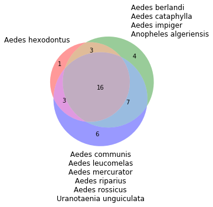

```python
# Install matplotlib extension for Venn diagrams
# Run following command from the notebook

# !pip install matplotlib-venn

# Docs: https://pypi.org/project/matplotlib-venn/
```


```python
import pandas as pd
from matplotlib import pyplot as plt
import numpy as np
from matplotlib_venn import venn3, venn3_circles
```


```python
data = pd.read_csv('/Users/andrespatrignani/Dropbox/Teaching/Scientific programming/introcoding-spring-2019/Datasets/mosquito_abundance.csv',
                  skiprows=1,
                  sep=",")

data.head(5)
```


<div>
<style scoped>
    .dataframe tbody tr th:only-of-type {
        vertical-align: middle;
    }

    .dataframe tbody tr th {
        vertical-align: top;
    }

    .dataframe thead th {
        text-align: right;
    }
</style>
<table border="1" class="dataframe">
  <thead>
    <tr style="text-align: right;">
      <th></th>
      <th>Species</th>
      <th>sweden_farms</th>
      <th>sweden_peri_urban</th>
      <th>sweden_wetlands</th>
      <th>netherlands_farms</th>
      <th>netherlands_peri_urban</th>
      <th>netherlands_wetlands</th>
      <th>italy_farms</th>
      <th>italy_peri_urban</th>
      <th>italy_wetlands</th>
    </tr>
  </thead>
  <tbody>
    <tr>
      <th>0</th>
      <td>Aedes albopictus</td>
      <td>0</td>
      <td>0</td>
      <td>0</td>
      <td>0</td>
      <td>0</td>
      <td>0</td>
      <td>37</td>
      <td>272</td>
      <td>4</td>
    </tr>
    <tr>
      <th>1</th>
      <td>Aedes behningi</td>
      <td>0</td>
      <td>2</td>
      <td>13</td>
      <td>0</td>
      <td>0</td>
      <td>0</td>
      <td>0</td>
      <td>0</td>
      <td>1</td>
    </tr>
    <tr>
      <th>2</th>
      <td>Aedes berlandi</td>
      <td>0</td>
      <td>0</td>
      <td>0</td>
      <td>0</td>
      <td>0</td>
      <td>0</td>
      <td>0</td>
      <td>1</td>
      <td>0</td>
    </tr>
    <tr>
      <th>3</th>
      <td>Aedes cantans</td>
      <td>0</td>
      <td>4</td>
      <td>3</td>
      <td>0</td>
      <td>0</td>
      <td>0</td>
      <td>0</td>
      <td>0</td>
      <td>0</td>
    </tr>
    <tr>
      <th>4</th>
      <td>Aedes caspius</td>
      <td>0</td>
      <td>1</td>
      <td>0</td>
      <td>0</td>
      <td>0</td>
      <td>0</td>
      <td>5</td>
      <td>9</td>
      <td>1664</td>
    </tr>
  </tbody>
</table>
</div>


```python
total_farms = data.sweden_farms + data.netherlands_farms + data.italy_farms
idx_farms = (total_wetland == 0) & (total_farms > 0) & (total_periurban == 0)
farms = data.Species[idx_farms]

total_periurban = data.sweden_peri_urban + data.netherlands_peri_urban + data.italy_peri_urban
idx_periurban = (total_wetland == 0) & (total_farms == 0) & (total_periurban > 0)
periurban = data.Species[idx_periurban]

total_wetland = data.sweden_wetlands + data.netherlands_wetlands + data.italy_wetlands
idx_wetland = (total_wetland > 0) & (total_farms == 0) & (total_periurban == 0)
wetland = data.Species[idx_wetland]

idx_farm_wetland = (total_wetland > 0) & (total_farms > 0) & (total_periurban == 0)
farm_wetland = data.Species[idx_farm_wetland]

idx_farm_periurban = (total_wetland == 0) & (total_farms > 0) & (total_periurban > 0)
farm_periurban = data.Species[idx_farm_periurban]

idx_wetland_periurban = (total_wetland > 0) & (total_farms == 0) & (total_periurban > 0)
wetland_periurban = data.Species[idx_wetland_periurban]

idx_farm_wetland_periurban = (total_wetland > 0) & (total_farms > 0) & (total_periurban > 0)
farm_wetland_periurban = data.Species[idx_farm_wetland_periurban]

```


```python
# A, B, AB, C, AC, BC, ABC
v = venn3(subsets=(farms.size, 
                   periurban.size,
                   farm_periurban.size,
                   wetland.size,
                   farm_wetland.size,
                   wetland_periurban.size,
                   farm_wetland_periurban.size), 
          set_labels = ('\n'.join(data.Species[idx_farms].values), 
                        '\n'.join(data.Species[idx_periurban].values), 
                        '\n'.join(data.Species[idx_wetland].values)))
```




